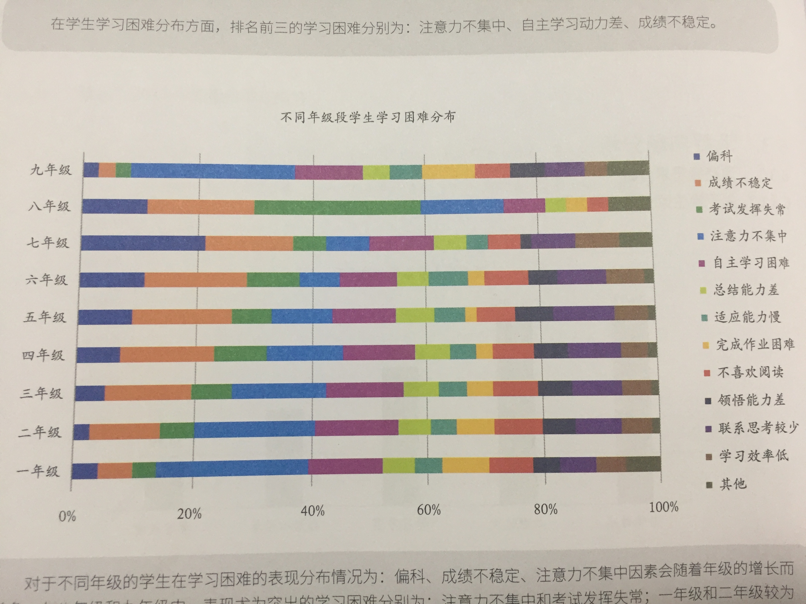

# 注意力集中的习惯

[[返回上一级|/Home]] [[_TOC_]]

为什么是注意力呢？ 我们从一些吐槽开始说起：

- 有一个妈妈说，"我们家孩子每次写作业，你要是不看着，他一会儿摸摸橡皮，一会儿倒饬铅笔盒，任何能够吸引他的东西，都能让他走神。写个作业要好几个小时，天天如此，我下了班之后继续 上班。"
- 另一个妈妈这么说的："眼睛里看到5,脑子里想的可能是5,嘴里说出来的是6,手里写下来的是7。问什么好像都明白，一做题错一半。学生字，一学就会，第二天忘掉多一半。你说他过脑子了嘛?

你看，上述描述基本都是注意力集中问题和基本的时间意识、时间管理能力弱造成的。当然也有记忆力等方面的问题，我们不混在一起讲。不过我一直想跟你聊的问题是，为什么孩子写作业还要看着呢？孩子都已经上小学了，不应该注意力集中的习惯已经养成一大半了嘛？小学一年级开始看着孩子写作业，还不要说到考大学，就说小学6年，一年上学的日子250天，所以要看着写1500多天？

注意力到底是什么呢？我们先从概念开始说起。**心理学上讲，注意是指人的意识集中和指向一定的事物，也就是将心理资源集中在一定的事物或信息上**。我们做任何事情都是从注意开始的。**注意是人脑加工信息的必经过程，它的发展情况会对孩子的学习效率、学习质量产生重要影响**。"

你看，咱们不能小看了注意这个词，它有着这么非常深刻的心理学定义。**孩子在6-9岁，在完成学习任务时，大多数孩子可以连续集中注意力20分钟左右**。注意，我说的是完成学习任务，要是玩儿的话，孩子可以专注远超过这 个时间。换句话说，小学中低年级的孩子集中和控制注意力的能力较弱，在完成学习任务时尤其明显。

**大脑额叶区域的功能与注意有关，而额叶的发育会一直持续到青春期。由于受到大脑发育的限制，所以孩子注意力集中时间较短、自我控制能力较弱、容易分心是很正常的**。随着额叶脑区发展的完善，孩子控制注意力的能力会越来越强，注意力集中时间也不断增加。所以，很多家长的焦虑是因为对孩子的发展不够了解，预期太高了。

**注意力问题是一年级的孩子最为担忧的问题**

## 注意力的培养早开始，入学适应不用愁

咱们经常会说"不打无准备之仗"，意思就是要做事前管理，这在培养孩子的注意力方面也是一样的。你看，陪着孩子写作业、孩子注意力不集中去干预、去吼，这都是事中管理和事后管理，效果大打折扣且很容易陷入恶性循环。

注意力集中的习惯，最好是从3-6岁开始培养。上学之前培养基本的注意力集中的习惯，上学之后无论是孩子还是你，压力都会小很多。 注意力的培养我给你总结了4个方法:

### 方法1:不破坏就是培养

如今咱们的家庭结构，都是4-2-1形态的，也就是4位老人、爸爸妈妈再加上1个孩子的结构，对孩子的注意力培养并不友好。为什么呢？因为6个大人一起爱、一起关注孩子，也在争夺孩子的爱和关注。

在3-6岁这个年龄区间，孩子有大量的时间在家。每当孩子安安静静地开始自己探索世界、摆弄玩具或者沉浸在翻看书籍的时候，6位大人经常不自觉地扮演打断、干扰孩子的角色。孩子还没坐下5分钟，爷爷来了。"宝宝，要不要喝口水啊？"又没有5分钟，奶奶来了。"宝宝，我给你削了苹果，你吃一口吧？"又过了5分钟，姥姥来了。"宝宝，咱们喝一杯牛奶吧？"在这个过程中，原本完全能安安静静玩儿 15-20分钟乐高的孩子，注意力被打断了三次。

其实，我经常跟身边的每一位家长朋友说，孩子注意力集中的习惯，只要不被打断和破坏，其实就是一种培养。

### 方法2: 3-6岁，寓教于乐，从孩子的喜好出发培养注意力

孩子在3-6岁没有进入小学之前的这个年龄段，是发展心理学家说的儿童早期，也就是学龄前的时期。这个时期孩子的大脑并没有做好大规模接受知识的准备，所以他们一直处于在玩儿中学的状态，在体验、观察、探索的过程中认知世界。

所以，一些简单的小游戏对于孩子注意力集中的培养非常有帮助。最常见的就是拼插类的玩具，比如积木、乐高、拼图等等，**这些拼插类的东西往往需要比较长的时间进行搭建，非常容易让孩子沉静下来，集中注意力**。

当然，正是由于这些东西都需要比较长的时间，你要循序渐进，比如，拼图肯定要从20块、50块的开始，才能逐渐过渡到100块或者500块、甚至1000块的。

在孩子玩儿的过程中，可能3岁的时候孩子希望并要求你参与。随着孩子年龄的增长，爸爸妈妈要适度开始放手，比如到了4岁或者5岁，你在旁边看书（注意不是玩手机哈）孩子在搭乐高，陪同就可以，不需要太多参与。**到了5岁或者6岁，就能够让孩子尽可能自己进入这种注意力集中的状态**，为进入小学转向学习任务做好准备一一 **你一定要记得，孩子写作业，原本是不需要陪的**。

还有一些活动和小游戏有多种功能，比如用筷子或者小木棍、chips (就是像筹码一样的小圆片）等跟孩子一起进行数感的启蒙，加减法的启蒙。比如，亲子阅读，固定时间给孩子读绘本。这些活动和小游戏不仅仅可以帮助孩子训练注意力集中，还有学习启蒙、提升理解力、打开知识面等等一系列的好处。

### 方法3:不是每个孩子都"一日之计在于晨"，根据孩子自己的注意力规律安排时间

咱们中国人总说"一年之计在于春，一日之计在于晨"，实际上这是一种农业社会流传下来的习惯和经验，毕竟在没有电灯的年代，世代以农耕文明著称的中国人是"日出而起，日落而息的"。但是，"一日之计在于晨"并不是现代心理学的研究成果。研究者发现一天中 **孩子注意力集中的情况可以分为三类，分别是昼间型、夜间型和混合型，这在心理学上叫做"注意力日周期节律"**。

- 昼间型的孩子上午7点注意力水平最高，然后下降，下午3点后注意力水平稍有回升。
- 夜间型的孩子在白天，注意力水平是随着时间不断上升的，晚上7点达到最高峰。
- 混合型的孩子是上午10点注意力水平最高，中午开始下 降，下午3点又开始回升，晚上7点注意力水平出现第二个高峰。

因为存在这三种不同的类型，意味着你要寻找和塑造最适合孩子的注意力日周期节律。怎么做呢?就是在日常生活中，观察孩子的行为和活动表现，**了解孩子大约在什么时间容易犯困、什么时间老想着跟别的小朋友玩儿、什么时间能安静坐下来玩玩具、做乐高，根据孩子注意力起伏的特点，来安排时间**。

这样一来，等到孩子上了小学，你就能合理利用孩子注意力最集中的时间段，提高孩子的学习效率，这样就可以避免孩子写作业还要陪、注意力不集中就要吼的情况发生。

### 方法4: 6岁以上，注意力培养也有方法

注意力集中这个习惯，是应该在3-6岁开始培养的。这样进入小学的时候，就会比较轻松。但是对于已经进入小学的孩子来说，你该怎么办呢? 前面已经说了，**6-9岁的孩子在注意力集中方面还相对较弱，这是由于生理的限制，这个年龄段的孩子难免出现注意力不集中的现象**。所以，这个时候才开始培养孩子注意力的爸爸妈妈，也有方法

#### 第一，首先要降低自己的心理预期

**不要对低年级孩子在注意力集中的时间长短上提出过高的要求**。当孩子出现分心时，不要过度责骂，不要动不动就吼一一如果吼能管用倒也罢了，更多的是不仅 没有用还严重破坏亲子关系和孩子的性格发展。所以，对6-9岁的孩子，尊重孩子的客观发展规律，不要提出过高的要求。

#### 第二，买一个计时器，帮助孩子培养注意力集中的习惯。

给孩子设定一个 **注意力集中的模块为25分钟**。每到25分钟左右的时候，给孩子5分钟休息的时间，想摆弄橡皮铅笔尺子再摆弄，然后进入下一个25分钟。所谓"文武之道，一张一弛"就是这个意思了。

#### 第三，持之以恒。

任何习惯的养成，都需要时间的积累，这个时间并不是21天，心理学家给出的时间大约是66天甚至更长。有耐心，持之以恒，很重要。那么，对于更大一些的孩子，就是进入小学中高年级了，也就是9岁以上了，孩子的注意力能保持更长的时间。每40分钟左右是一个注意力集中的模块，比较合理。不仅如此，你不用再像孩子小的时候那样小心翼翼，而是正常在孩子学习的吋候该说话说话、该干嘛干嘛。

这个时候，注意力集中就升级了，还要能抗干扰。而适当的"干扰"有助于培养孩子抗干扰的能力。毕竟，无论是小升初、中考还是高考，有干扰的情况发生才是考试中或者未来生活中的常态。在家中，不应长期让孩子在绝对 安静的环境下学习和作息，否则孩子在其它环境中就很难专注了。

当然，对于培养孩子的任何一种习惯，在孩子能够做到一点点的时候，给予及时的、真诚的肯定和鼓励非常重要。

可以说，注意力集中是所有学习习惯的基础，那么有了它，才可能培养其它的学习习惯。
