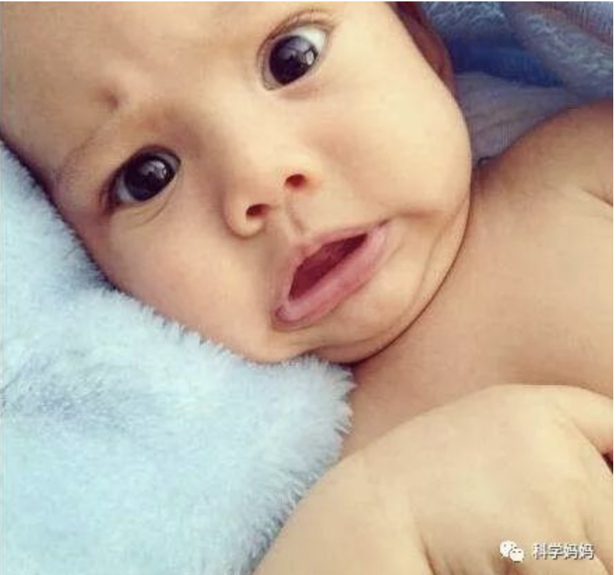
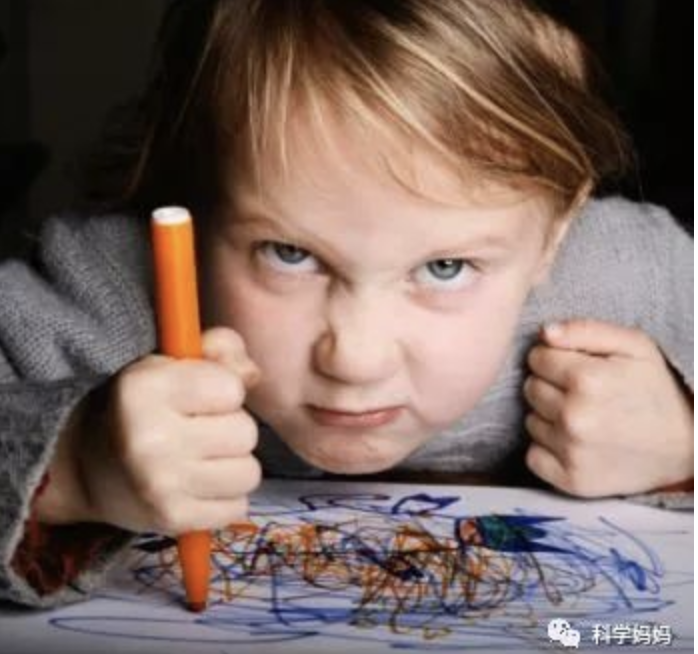

# 帮助孩子成为情绪调节的高手(下)

对于3-6岁的孩子而言，他们还谈不上很好的管理和调节情绪，他们首先要能够 **去理解和表达自己的情绪，而理解和表达自己的情绪，需要你的帮助和引导**。

上了小学之后，孩子们遇到的情况比幼儿园的时候复杂多了。作业题不会做，考试没考好，跟小朋友闹矛盾啦，铅笔又被偷走啦，又被老师批评啦。然后女孩子们都不喜欢自己不跟自己玩啦。遇到这些事儿，孩子的情绪就会受到干扰产生波动，那么如何帮助孩子管理和调节自己的情绪呢？

## 帮助孩子发现正确的方法来调节情绪

**从孩子五六岁的时候，慢慢开始引导孩子进行情绪调节**

爸爸妈妈首先一定要闹记于心，就是孩子的很多行为并不是故意的，而是他们不会去应对自己的情绪。比如愤怒时摔门、砸东西，面对自己喜欢的人甚至去咬他等等。对于情绪的管理和调节，你不要让孩子自己去在不停的磕磕绊绊中发现正确的方式。

1. 恐惧时，找爸爸妈妈谈谈

2. 想要表达关怀和谢意可以告诉别人或者送小礼物

3. 伤心时可以哭出来，可以找爸爸妈妈谈谈，可以写日记

4. 高兴时，可以表达，笑容和快乐能够传递，让别人也开心

5. 愤怒时候，深呼吸，可以用运动的方式调节

## 帮助孩子管理和调节自己的情绪，首先要理解孩子的情绪

而理解孩子情绪也需要注意两个要点**：

- 情绪调节存在性别差异，与男孩相比，女孩更善于调节情绪，向他人寻求帮助。所以男孩的爸爸妈妈就要多费费心了，帮助孩子面对情绪问题

- 内向型的孩子更需要引导：情绪调节策略和孩子的个性有关系。即使面对相同的压力环境，不同性别的孩子情绪调节的策略，调节的方向也会有所不同。外向型的孩子更可能采用以问题为中心的应对方法，寻求他人的支持等。而内向型的孩子可能会采用逃避、原理等以情绪为中心的应对方式。所以如果你刚好有一个内向型的孩子，也需要多费费心。

说道情绪的管理和调节，先给你介绍一下，人的情绪应对的方式有两种，一种叫以情绪为中心、另外一种是以问题为中心的应对方式。**好的情绪管理和调节，就是要帮助孩子，从以情绪为中心逐渐向以问题为中心的调节方法变化**。

- 以情绪为中心的应对方式：控制和改变已经产生的消极情绪，这包含远离、情绪伪装等，比如考试没考好，孩子就长时间的发呆、暴饮暴食、不停地玩游戏，用饮食和玩耍的快乐替代没考好的悲伤。

- 以问题为中心的应对方式：指的是确定困难所在，并下定决心处理该问题，从根本上解决情绪诱因，这包括问题解决、寻求支持、寻求外在原因等方式。例如，考试没考好，孩子能够分析原因、认真学习、请教老师、准好好下一次的考试。

## 帮助孩子成为情绪调节的五步法

没有家长的帮助，绝大部分孩子是不会自然而然的发生这样的变化的，帮助孩子成为情绪调节的高手五步法：

- 理解孩子的情绪

- 接纳孩子的情绪

- 引导表达、舒缓（深呼吸、香气、到公园或者水边）、建设性的宣泄（倾诉、运动、找合适的场合喊叫）或转移（听音乐等）

- 分析情绪波动的诱因

- 提供解决方案

我们今天就以孩子某一次中期考试没考好为例，叫你帮助孩子成为情绪调节的高手。首先刚刚进入小学孩子，第一次面临这种情况的时候，一定会采取以情绪为中心的应对方式。每个孩子可能不太一样的方式表现出来，比如长时间的发呆、暴饮暴食、不停玩游戏。你一定要理解，孩子此时并不是自暴自弃，放弃治疗，而是一个六七岁的孩子，不知道怎么面对这种负面情绪，所以试图用饮食和玩耍的快乐替代没考好的低落和悲伤。而咱们大人不是也还在说，伤心了就吃个冰激凌或者包治百病这样的话嘛，实际上都是类似的。

但这并不是我们期待孩子应对负面情绪的方式，我们希望孩子能够迅速从这种低落和悲伤中走出来，确定困难所在，想办法去处理这个问题，从根本上解决情绪的诱因。什么叫做情绪诱因呢？就是诱发这个情绪产生的原因，那么这个五步法怎么做呢：

### 理解孩子的情绪

第一步是理解情绪。也就是说，孩子因为没考好所表现出来的所有行为，甭管是不是积极、都是有正当理由的。但是绝对部分的家长如果发现孩子考试没考好，还在那玩游戏，通常的反应是什么？一定是这样的，"你怎么还在玩游戏呢？你考成这样你还有脸玩游戏？"。得，这话一说，后面啥都没用了，更何况这句话本身就是你在宣泄情绪。所以如果你能理解孩子考不好还打游戏的这个方式，实际上是他在自己给自己施加的压力，用一种不太积极的方式应对他没考好带来的负面情绪。

### 接纳孩子的情绪

第二部就是接纳情绪。什么叫做接纳，不要说话，拍拍孩子的肩膀或者头部，把房门关上让孩子自己先玩一会儿，通过动作表达你的理解和接纳。当然你也可以用语言表达，敲敲孩子的房门，进到孩子的房间，然后跟孩子说："妈妈知道你没考好，情绪不好，没考好谁都不会开心的，而且妈妈也知道你复习的时候很努力。"，你看短短的两句话就完成了理解和接纳。

### 引导表达、舒缓、建设性的宣泄和转移当前的情绪

然后进入第三步，引导孩子去表达、舒缓、建设性的宣泄和转移当前的情绪。那我们先来看什么叫引导表达。表达和倾诉，实际上是非常好的情绪调节的方式，等孩子少儿我IQing徐缓和一点了，你就可以问问孩子。是不是还是心情不好，不太舒服。你要不要跟妈妈聊两句？咱们出去溜达溜达聊也可以。记住千万不要在这个时候责怪和埋怨，而是要创造平和的气氛，让孩子把这种不舒服说出来，可能会停一会儿，孩子就会跟你说，"我真的是懊恼死了，明明这道题我不应该做错的，我就看错了一个字，然后就做错了。"只要孩子有了表达，后面的问题就好解决了。

如果孩子本身比较内向，不善言辞也没关系，那就帮助孩子通过舒缓的的方式调节也是好方法，深呼吸、到公园或者水边的地方走走，我们大人在这样的空气清新、树木郁郁葱葱的地方都会觉得神清气爽，心情好很多，孩子也是一样的。那什么叫建设性的宣泄呢？找一个不会打扰到别人的地方喊一喊，哭一哭，或者找个地方跑几圈，这些方式都是建设性的宣泄。当然，咱们不能让孩子不分场合，部分地点就有大喊大哭，一定是找到合适的，不打扰人的地方在做。

在这里，告诉你一个重要的事实，很多人一提起情绪就喜欢用"控制"这个词，实际上是不对的，心理学上对情绪的描述性动词都是这样的，理解情绪、表达情绪、管理情绪、调节情绪，所有的动词都是积极想象的正面词汇，控制这个词对于情绪而言是负面的，所以再以情绪为中心的应对方式里，才会有控制这个词，相反，真正对情绪起到正面积极作用的也是正面积极的词。人有情绪是正常的，压制这种正常的力量，只会适得其反。

那什么叫转移？也很简单，就是允许孩子今天先别忙着学习、告诉他"你听听音乐或者看看动画片，或者看看你喜欢的玩具和你爱玩的乐高"。这些都是非常好的转移，转移也能够帮助孩子在情绪比较低落的状态下，让情绪有所好转。

其实什么是情绪调节？就是你把情绪想象为一条线，当情绪处于平稳状态的时候，他就是一条水平线。当情绪比较低落的时候，他就跌入了水平线以下，那么情绪高昂时，就飞出了水平线。那么情绪调节就是无论在线上还是线下，都恢复到水平线的状态，这就是调节。

### 分析情绪波动的诱因

经历了理解和接纳，然后引导表达、舒缓、建设性的宣泄和转移，孩子的情绪开始逐渐在水平线上，这时候，再去进行第四步的分析和第五步提供解决方案。

什么是分析？就是跟孩子坐下来一起沟通，这次考试没考好的原因到底是什么？是英语考试中单词拼写不过关，还是语文考试时作文跑题啦？是数学考试应用题没看懂？还是计算错啦？这些问题是平时就有还是考试中新暴露出来的，这些都是具体的问题分析。

### 提出解决方案

那当你把问题分析清楚了之后，这个情绪的诱因，就是为什么没考好，已经分析出来了。那我们就可以进行解决方案的状态。每一个问题都有不同的解决方案，比如说如果孩子是以前错过这回还错，说明需要一个错题集，错过的东西是不能在错的。比如说孩子数学的两个应用题没做对，是因为题目没有读懂，列式子就错了，但是按照列式计算是正确的，那就不应该让孩子去傻乎乎的做很多应用题，而是专门挑选20个应用题来练习读题，同时需要加强阅读方面的积累和训练。

讲了这么多，你一定已经熟悉了帮助孩子成为情绪调节高手的五步法：

- 理解孩子的情绪

- 接纳孩子的情绪

- 引导表达、舒缓（深呼吸、香气、到公园或者水边）、建设性的宣泄（倾诉、运动、找合适的场合喊叫）或转移（听音乐等）

- 分析情绪波动的诱因

- 提供解决方案

我们特别希望你看到并利用这5步法帮助孩子成为情绪调节的高手
