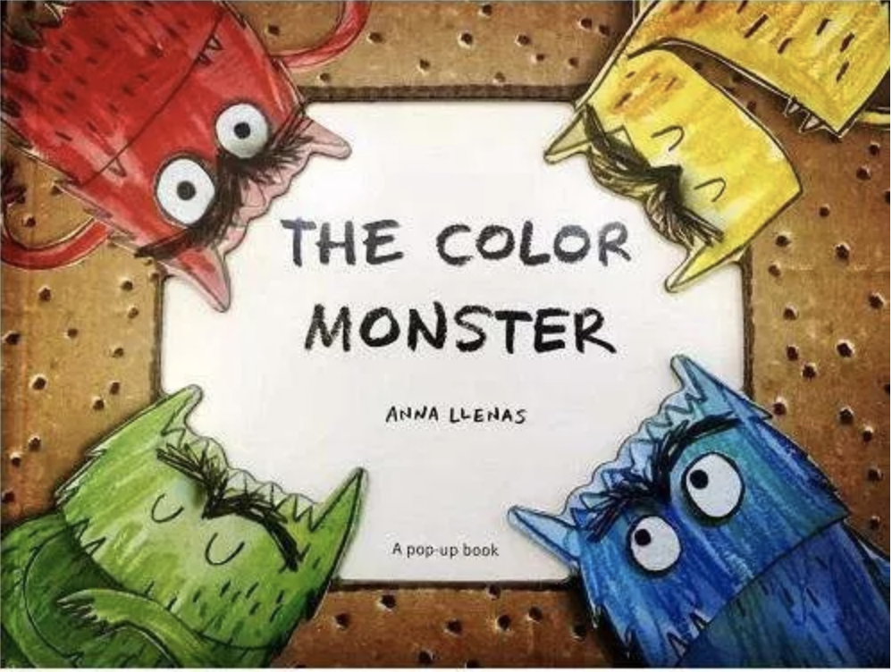

# 帮助孩子成为情绪调节的高手(上)

今天我们来探讨一个困扰很多家长朋友的问题，就是情绪。情绪为什么很重要呢？你可能面对3岁的宝宝不会表达情绪满地打滚、可能面对7岁的孩子因为一次考试没考好沮丧很久，可能面对一个打碎花瓶而你却没开口骂他的孩子却哭起来的手足无措，可能面对一个5岁宝宝在街上因为不给买一个玩具就哭闹到全世界都知道，也可能在职场中遇到不少人不太能调节好自己的情绪。换句话说，**情绪调节能力的高低，不仅仅会对孩子的成绩造成影响，还会对孩子一生的幸福造成影响**。

人类的情绪是一种普遍的存在，婴儿在6个月左右就能够对不同的面部表情表达不同的反应。人类的情绪往往会通过面部表情表达出来，有7种表情具有世界普遍性：快乐、惊奇、愤怒、厌恶、恐惧、悲伤和轻蔑。

## 引导孩子理解情绪

帮助孩子成为情绪调节的高手，首先要需要引导孩子理解和表达情绪。你也许会觉得奇怪，为什么情绪还需要理解呢？理解情绪一点都不简单。心理学家研究显示：3-6岁的孩子是只能够理解单一性质的情绪，对他们而言，真的是快乐就是快乐，悲伤就是悲伤，他们不懂什么是悲喜交加，也不懂喜极而泣。在7岁之前，孩子依然智能理解同一性质的情绪，比如都是积极或者都是消极。举个例子，7岁之前的孩子能够明白拿了奖就是开心和激动，而刚才的摔碎了东西就只会感到难过（因为做错事）。所以，当你偶尔看到一个剧在哭时，宝宝是没办法理解的。这种能力到底要什么时候才能形成呢？11岁以后！这个时候孩子才能明白为什么自己能在放暑假的时候既开心又难过，高兴是因为放假不用上课，伤心是因为要做那么多的作业或者是不能跟比较好的朋友天天见面和玩耍。

3-6岁。为了能够让孩子在6-12岁成为情绪调节的高手，就要先把准备工作做好。那就是理解和表达情绪，如何帮助孩子做到理解和表达情绪呢？

先说理解：

1. 理解孩子的感受和情绪

2. 接纳孩子的感受的情绪，不要否认孩子的感受和情绪

3. 使用你的语言，帮助孩子理解情绪

4. 积极回应，给与鼓励。

### 理解孩子的感受和情绪

这几句话你看来好像很好理解，但又有点抽象。我举个例子你就能明白啦。情绪的理解和表达比较复杂，那咱们先说说感受。感受是直接的，比如疼就是一种感受，饿也是一种感受。你可能像很多家长一样，一提到要带孩子去医院打针，简直就是噩梦----孩子每一次嚎啕大哭。很多的家长束手无策，难道就是没有方法嘛，当然有！

我们先看一下，每当孩子打针一哭，很多爸爸妈妈下意识的反应是什么？通常是这样两句反馈，一句是"宝贝儿，这个一点也不疼"，一句是"宝宝不哭"。结果呢。说完孩子哭声越来越大，而你也越来越着急，还混杂着心疼和无助，结果自己的情绪也跟着天翻地覆了。

宝宝为什么在你说完不疼后哭的更厉害了呢？因为"不疼"这两个字非但没有理解宝宝的感受，还否认了他的切身感受。打针难道就不疼了吗？事实是打针对于孩子而言明明很疼的啊。一个针扎进来了，孩子又疼又怕，你告诉他不疼，孩子的语言表达能力有限，只好用更大的哭声告诉你，妈妈我要疼死啦。

还有一种家长。通常是爸爸，这个时候用另外的方式表达了自己对孩子感受的不接纳，就是"你别紧张，放松点"。但是郑恩3-6岁的孩子说话，他能理解什么是别紧张，什么叫放松嘛。不能，他能接收到的信号是反正爸爸好像不是很在意我的感受，他说的话我又听不懂，我也不知道该怎么办。

你看，无论哪种方式，都没有做到理解和接纳孩子的感受，那正确的说法应该是什么呢，其实很简单，在打针之前，给孩子打好预防针。"宝宝啊，打针可能辉腾哦，妈妈知道你会疼，所以我会一直抱着你，你很勇敢，肯定没问题的"。打针的过程中，也用同样的话。

- 第一，打针可能会疼，表明了你理解孩子的感受

- 第二，妈妈知道你会疼，表达你接纳了孩子这种感受，且你还会抱着她，用动作表达这种接纳

- 第三，你告诉孩子他很勇敢，肯定没问题，这是一种巨大的鼓励。

刚才的例子说感受，那么下面来谈谈情绪，这是很多家长头疼的事情。比如，孩子四五岁了，喜欢搭积木或玩乐高，结果玩的时候一直挺开心的，但是有一块就是搭不好，尝试了好几次滞后，孩子的耐心么有了，就会表现出沮丧和生气的情绪，哗啦一下把整个搭好的积木全部推掉，然后开始哭闹。

是不是你也经历过，但是爸妈一般怎么处理呢：

- 第一种是你自己先生气了，冲孩子嚷嚷，你干什么啊，自己没搭好，发什么火！

- 第二种，稍微冷静一点，问，你怎么啦。

无论哪一种，恐怕都不是最好的帮助孩子理解和表达情绪的方式。

为什么。先想象一下，当你自己因为某件事儿非常生气的时候，身体会给你如何的反馈信号？描述一下，就是脊椎到后脑勺一股子火气蹭的一下就窜上来了，对吧。你看中文的"怒发冲冠"描述的还是非常精确。你作为一个成年人，对这个应该非常熟悉了，知道自己生气了，而且很可能会站起来走一走或者深呼吸平静一下，但是对于一个四五岁的孩子呢，自己费了半天劲的积木，怎么也搭不好，然后突然间身体出现了一股自己无法用言语描述的力量。

孩子无法用精确的语言描述自己经历了什么，也就不能理解这种情绪，又不知道到底应该怎么办才能让这种力量消失，那怎么办呢？最直接的表达方式，就是推倒所有的积木，用动作来传递和表达。我相信此时会生气的爸爸妈妈，多半是因为不理解孩子到底经历了什么，结果自己县生气了。而问孩子怎么的爸爸妈妈，通常孩子不会回应你，如果他能自己描述出来自己的感受，就不会用动作来表达了。

### 接纳孩子的感受的情绪，不要否认孩子的感受和情绪

说到这里，你一定已经理解了孩子的感受，但是如何接纳，你需要蹲下来，跟他一样高，一边抚摸他，一边问，宝宝你是不是不高兴，这个积木没有搭好，你觉得难过了？这时，你会发现孩子可能有两种表现：

- 孩子可能就已经开始点头了，因为她理解了你说的话，同时他通过你说的这个话理解了他自己此时经历的情绪（这个太重要了）

- 孩子没有直接回应你，但是情绪会逐渐舒缓。为什么，因为他借助你的表达，在理解自己的情绪，只是他可能还有几分钟懵懵懂懂理解的不是很清楚，不知道如何回应你。

### 使用你的语言，帮助孩子理解情绪

不管怎么说，你都会发现，这是一个非常好的开头，我们刚才讲了，理解之后就是接纳，你要说什么？对！告诉孩子"妈妈知道你花了很多时间来搭积木，没搭好所以不开心了，来过来给妈妈抱抱"。等到孩子完全平复下来之后，我们再给继续的反馈，"宝宝，你现在还想继续搭积木嘛? 如果你想搭配，妈妈在旁边给你当帮手，好不好？如果你现在不想搭，咱们就改天再搭。" 把这个选择权给到孩子。

### 积极回应，给与鼓励。

说到这里，这件事儿就算告一段落，帮助孩子下次遇到同样状况的话，不要推倒积木这些话不着急立即说，而是等到那天跟他相处时，他的情绪比较平静的聊天时候再说也不迟。但是作为3-6岁的妈妈，你不要对说一次管用抱太大的信心，因为孩子能够去理解和表达情绪已经很不容易了，懂得情绪管理和调节，那是很多大人都做得不太好的。

情绪的管理和调节，跟特定的大脑脑区的发育有关，对于人类而言，这个和情绪相关的脑区要到很晚才会成熟，3-6岁，不能要求太多。

## 引导孩子表达情绪

刚才说了如何帮助孩子理解自己的情绪，那么第二部就是帮助孩子识别、理解进而用语言和非语言的形式争取的表达情绪。这里我们也讲3个点。

### 别问孩子你怎么了，3-6岁的孩子描述不出来，需要一般疑问句

用精确丰富的词汇表达自己的情绪，是非常难的。需要认知发展和社会心理发展到一定的水平才能做到，所以直接询问孩子不是好方法，如果你发现孩子对表达情绪的词汇没有比较好的理解，图片是很好的方式，一个是笑脸，一个是哭丧的脸。还有一张呢，是不太有表情的脸。每一次宝宝遇到什么时期表达不出来，你就可以让他指是哪一种，同时你在用语言描述，帮助孩子理解每个表达情绪的词汇，慢慢的把自己的情绪和眼前的这个图片，再和你交给他的词汇对应起来，帮助孩子理解和表达自己的情绪，在强调一下，理解和表达情绪，是管理和调节情绪的前提。

买情绪小怪兽的书

### 需要引导孩子正确的使用非语言方式表达情绪

**非语言表达：兑礼物不喜欢的时候表达失望**

比如有一个阿姨送了孩子一个礼物，但是孩子并不喜欢这个礼物，但对于孩子而言，他有的时候会很直接的表达出来自己的失望和不高兴，这不是很好的社交表达，我们要如何帮助孩子正确表达这种情绪呢？这就要看你如何引导啦！

- 第一种家长会说："你怎么这么不识好歹，别人送你的东西你还不喜欢" 这是一种非常糟糕的表达方式

- 第二种家长会说："阿姨送礼物给你，是喜欢你，你不喜欢，阿姨会多伤心啊"。你可能一下子没有听出这种表达的问题，但是新一代的孩子个体独立性需求很高，他会觉得喜欢和不喜欢这就是事实，为什么别人送礼物你就要强迫我喜欢呢？因此，第二种方式的逻辑也有一些问题。

真正比较好的引导方式是，跟孩子说，"阿姨送礼物给你，无论你喜不喜欢，阿姨的心意是很珍贵的，都是要表达感谢的啊。"所以喜不喜欢是个人的爱好，都没有关系，阿姨的心很珍贵，所以要让孩子理解此时应该表达谢意。

### 学会跟孩子分享自己的感受和情绪

**你不是超人，跟孩子分享感受和情绪，才能换来孩子的体量和成长**

不知道你是不是跟很多妈妈一样，有一种非常不切实际的想法，就是做一个完美的妈妈，把自己当成超人，妈妈也是人，妈妈也会疲惫，也会在公司里面遇到不开心的事儿。可是回到家，孩子又有很多陪伴的需求。我就曾经教过一位妈妈，和孩子分享自己的感受和情绪，刚开始的他不以为然，说我家女儿才刚满6岁，还没上小学，怎么分享。

## 共情能力的培养，有助于未来的生活幸福

有一天这位妈妈晚上快8点回到家，又累又饿，而工作也很烦心。回到家之后，女儿一天没见妈妈就黏上来，让妈妈陪着玩。这一次她说：宝宝，妈妈今天好累啊，而且工作中也遇到了一些问题，我不是很开心，所以我特别想歇一会儿，你看要不让你妈妈歇半小时，我再陪你吧。"这简单的几句话清楚表达了妈妈的感受和情绪，第一很累，第二：不是很开心，另外也提出请求，需要休息，而且是半小时后就可以陪他玩。

说完之后，孩子先是一愣，想了一下，跟妈妈说，那你去好好休息吧。这位妈妈就定了一个脑中，躺在沙发上歪着，半醒半水之间，她听到自己的女儿跟她爸爸说，妈妈今天很累，他在休息，你不要打扰她。到了半个小时后，女儿跑过来问妈妈，是不是休息好了，有没有到了半小时？

你看，这个过程多么温暖。你也可以用类似的方法来处理类似的事情。不仅满足了自己和孩子双方的需求，还给孩子树立了一个榜样。如果遇到情绪问题都跟别人表达，同时用这种分享的方式，也能过让孩子学会体谅，这对孩子来说也是一种成长。

说到这里，必须提醒你：**父母的情绪表达和处理方式会对孩子产生巨大影响。如果孩子与父母朝夕相处的过程中，你经常表达积极情绪，理解他人情绪，孩子也会倾向于表达和表达积极情绪**。

如何帮助孩子理解情绪，我们用了一个打针的故事，一个孩子搭积木没搭好的故事。需要学习以下四点：

- 首先能先理解孩子的感受和情绪

- 接纳孩子的感受和情绪，不要否认孩子的感受和情绪

- 使用你的语言，帮助孩子理解情绪

- 积极回应，给与鼓励。

对于情绪的表达：

- 可以用一般疑问句，甚至用图片帮助孩子表达

- 需要引导孩子正确的使用非语言方式表达情绪

- 学会跟孩子分享自己的感受和情绪

后面，我将在情绪的理解和表达的基础上，教你如何培养孩子进行情绪的管理和调节。
