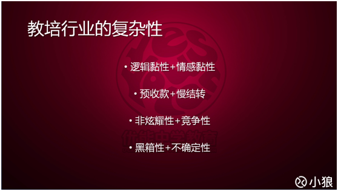
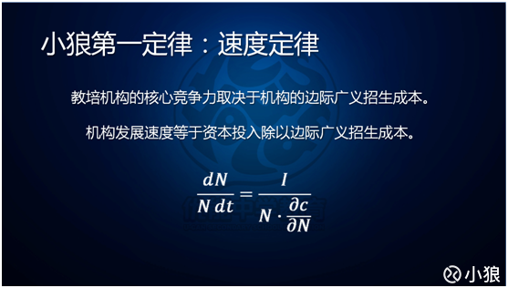
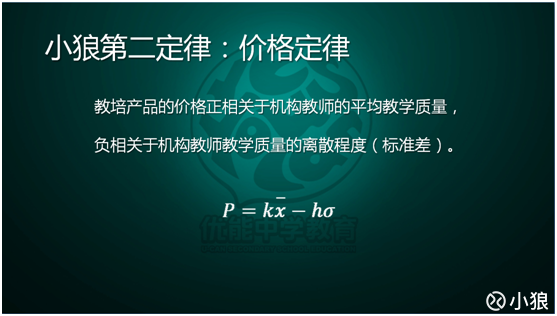
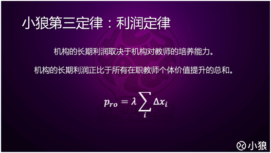

在纽交所上市的中概教育股新东方和好未来的股价近日达到历史高位，两家公司在K12领域的亮眼业绩成为股价进一步上涨的有力支撑。在教培龙头企业利好消息的刺激下，近期又有不少雪球网友向我咨询什么样的教培机构拥有核心竞争力，除了边际招生成本外，还有哪些因素将从本质上影响机构的长期发展。本篇文章笔者将从自身十年的行业观察研究中提取总结三条行业定律，分享给各位读者，希望能通过这三条定律帮助读者们解决心中的疑问。
人类研究任何一个领域，都是经历了描述现象、解释原理、预测趋势和控制结果四个阶段，分别代表了人类在文学、哲学、科学和数学的发展与应用。越是简单直观的领域，越不需要复杂深入的研究，只用文学描述和哲学解释即可。越是复杂反直觉的领域，越需要依靠严谨的科学论证和精确的数学计算进行分析处理。那么教培行业究竟是一个简单的领域还是一个复杂的领域呢？ 

教培行业为何如此复杂？

首先，教培行业的运营模式就比其他行业更为复杂。笔者曾经在系列文章第七篇写过，与其他服务行业不同，教培行业是一个既重视体验又重视结果的行业，这导致这个行业既有情感黏性又有逻辑黏性。娱乐行业就是只有情感黏性的行业，消费者使用娱乐行业的产品没有情感以外的诉求，粉丝与娱乐产品的情感黏性越强则消费频次越高。因此娱乐行业产品一般不会出现消费者在不情愿的情况下被强制消费的情况。但是教培行业不同，它的产品有明确的目标，即使学生不愿意接受培训，不喜欢老师，也可能会在特定目标指引下被强制消费。另一方面，餐饮行业和医疗行业的消费逻辑很清晰，有明确的结果诉求，就是吃饱饭和看好病。如果指望通过加强餐厅服务员和食客的情感黏性或者加强医院护士和病人的情感黏性来增加消费频次，这是很荒谬的行径。但是教培行业不同，学生和教师会形成天然的情感依赖。教师越关注学生越帮助学生，学生越愿意接受教师的指导与教育，产生更好的学习效果以及更高的消费频次。反之，如果更换已经产生情感黏性的教师，哪怕替换上来的教师更优秀更出色更能帮助学生提高成绩，仍然会造成部分学员的流失。所以作为同时拥有情感黏性和逻辑黏性属性的行业，教培行业的运营模式会比其他服务行业更加复杂，情感黏性与逻辑黏性任缺一个都可能导致机构失去市场份额。 
其次，教培行业的收入模式也比其他行业复杂。教培行业是天然的预收款并且慢结转的行业。有的读者可能会不以为然，因为在餐饮行业、健身行业和美容美发行业中都存在预收款现象。但是只有教培行业才是“天然”的，不需要任何额外优惠和引导（当然，如果有优惠可以加大预收力度）就能实现预收款。只有一个行业的产品是刚性需求、有长期整体消费目标并且目标有明确截止点的时候，这个行业才能拥有天然的预收款且慢结转属性。在其他行业，现金流越好，说明这个企业越健康。这是因为其他行业大多是一手交钱一手交货，或者结转速度极快，此时现金收入等同确认收入，可以非常精准地计算出收入成本与利润。然而教培行业的天然预收款满结转容易让从业人员产生错觉，把应当在财务报表中计为债务的预收款当成自己的利润，盲目地折扣促销、市场扩张，导致实际成本远远高于收入。教培行业过度的预收款模式就如同弱化版的庞氏骗局，只要销售收入还在扩张，那么已经危如累卵的机构还能表面上活得风风光光。一旦销售扩张不如预期，立马导致资金链断裂，机构资不抵债，只能倒闭跑路。现实也是如此，小心谨慎对待预收款的新东方好未来成为了行业霸主，而疯狂做大现金流的培训机构几乎都折戟沙场。 
第三，教培行业的市场模式也比其他行业复杂。传统行业的市场模式往往是先通过大量市场营销产生初期种子用户，再通过用户之间口碑营销从而降低边际市场费用，如果人品爆表还有可能突然形成“病毒式营销”产生链式反应，爆发式扩张迅速占领市场（例如苹果的iphone4手机）。口碑营销依赖于消费者的口碑传递意愿。所有行业中，“炫耀性消费”是消费者最有意愿进行口碑传递的产品。很不幸，教培行业的产品并不具备“炫耀性消费”的属性。更不幸的是，教培行业的产品还是极其罕见的具有“竞争性消费”的属性。教培行业的产品的目标是帮助用户提升成绩或掌握技能，根本上是帮助用户在社会中更具备竞争力。这种目标带有排他的竞争属性。例如一个家长使用某种教培产品使得孩子成绩提升，从经济理性人角度来看，他一定不希望他孩子全班同学都使用这个产品。这种“竞争性消费”属性将阻碍教培行业产品口碑的传递，即使是优秀产品的市场成本仍然高居不下。因此教培机构的市场模式无法完全套用其他行业，必须另辟蹊径才能脱颖而出。 
最后，教培行业的产品模式也比其他行业复杂。绝大多数行业提供的产品都是“白箱”产品，也就是说产品的运行机制非常的清晰明了，很清楚地知道什么样的产品能达成消费者的诉求和目标，或者有明确的科学途径和手段来改进产品（例如医药行业）。然而教培行业的产品却是“灰箱”、甚至是“黑箱”产品，我们并不能完全掌握教培产品提升学生成绩的严格运行机制。准确地来说，今天的科学技术发展，我们已经能准确地掌握教师教学输出的运行机制，我们能判断出什么样的老师是优秀的“信息输出”教师。然而学生成绩的提升并不能只依靠教师的“输出”，还依赖于学生本身对“信息输入”、“信息内化处理”、“信息再输出”的能力。而这是当今的科学技术仍然没有弄清楚的意识与认知领域，有待未来脑科学研究的突破。这种“黑箱”属性使得产品最后的结果具有巨大的不确定性。教培行业的客户目标导向明确，对于消费者而言，如果最终的结果达不成期望，那么中间所有努力都变得几乎没有意义。因此消费者对于教培行业需要的是一个直接通往结果包含“黑箱”部分的“完整产品”，而不太愿意只去购买提升成绩过程中某部分环节的产品。这就是为什么教辅书只能卖30元，而拿着这个教辅书上课的老师却能卖出3000元的产品。因为教辅书无法为最终结果负责（“非完整产品”），而老师却可以成为对结果负责的责任人（“完整产品”）。教培行业结果的不确定性使得不对学生结果负责的“非完整产品”，哪怕技术再先进，也无法卖出合适的价格（例如题库产品）。 
从上面四点可以看出，教培行业真的是一个非常特别而又复杂的领域，需要用严谨的科学实验与理性分析才可能得出正确的规律与结论。而复杂领域的规律和结论往往是反直觉的，因此很多人凭着直觉和在其他行业的经验进入教培行业，并不能取得很好的发展。投资者仅仅凭经验直觉和数据的表层分析也难以看清教培机构未来的发展趋势。因此笔者通过自己十年来对行业的观察研究，得出了三条独立的经验公式定律，分别剖析投资者最关心的培训机构增长速度、定价能力、赢利能力这三个竞争力指标。缺乏理工科训练背景的读者可以自行忽视数学公式，直接看定律的分析与应用。

速度定律

教培行业的第一条定律是速度定律。教培机构的核心竞争力取决于机构的边际广义招生成本，机构的发展速度等于资本投入（单位时间）除以边际广义招生成本。关于教培机构的核心竞争力，笔者在系列文章的上一篇已经进行了详尽的讨论和分析，请没有读过的读者自行移步阅读，本篇不再做重复论述。边际广义招生成本直接取决于机构是否能低成本地获取学员家长对于产品最终效果的信任。上一篇提到，教培行业的不断进化，就是招生模式的不断进化，从名师导向到销售导向再到课程导向最后到行为导向。事实上，这四种导向分别对应了教培产品获取家长信任的四个方面：课堂体验、客服咨询、产品内容、课后落实。当行业不断进行到新的阶段时，并不是全盘否定以前的做法，而是不断调整上述四个方面对于招生影响的比例，使得这个比例正好满足当前消费者市场诉求的最优占比。学而思和新东方优能在K12培训市场的快速崛起的本质原因就是把握住了教培市场的变化，以更低的招生成本介入市场，取得更强的竞争力而成为了增长速度最快的培训机构。 速度定律揭示了教培机构的兴衰规律。
一家三四线城市的机构或者一家在线教育公司目前看起来生机勃勃很有可能只是恰好踩中了一个不成熟市场中不成熟消费者的不成熟信任诉求。如果他不能及时调整运营方式跟上消费者的成熟步伐，必然会遭到市场的抛弃。而一家培训机构的销售部门（咨询部门）应该是对消费者市场最为熟悉和了解的部门，理应承担起寻找获取信任动机的四个方面在当前消费者市场诉求最佳占比的工作。 

价格定律

教培行业的第二条定律是价格定律。教培产品的价格正相关于机构教师的平均教学质量，负相关于机构教师教学质量的离散程度。关于教学质量的定义，请大家参考系列文章的第七篇，代表的是教培产品带给学生的体验和结果的总和。定律中的价格指的是均衡价格，即既不能带来需求增加也不能带来需求减少的价格。现实中的定价有时为了促进业务增长或者促使利润提升而低于或者高于均衡价格，会等效于机构进行了正投资或负投资从而使得招生人数增长或下跌。由于教学质量是体验和结果的总和，所以不同班型的产品无法只用教师水平来衡量教学质量。例如一个名师的大班课程带给学生的体验和结果很有可能比一个普通老师的1对1课程带给学生的体验和结果要差，所以1对1课程定价会比班课定价要高，但并不代表班课教师的教学水平低于1对1教师。 
关于该定律，首先要说明的是，在同一个机构（或同一个平台）中的同一类教培产品，即使不同教师教学质量有差别，也不能进行普遍的因师定价，只能采用统一的价格，这和其他行业有着巨大的不同。这是因为教培行业提供的是“黑箱”产品，同时又是结果导向的刚需产品，这使得几乎没有家长愿意在明知教师在机构（或平台）中处于次要梯队而购买这个教师的课程，哪怕价格更便宜一些也不愿意。他们宁愿去更次的机构寻找这个机构中最好的老师。这样在机构中会出现强马太效应，即最好的老师进一步获得更优的资源和最多的学生来源，而其他老师因为没有学生而逐渐被淘汰，最终这家机构一类产品只能存在一个老师。这就是台湾和香港的模式，他们大多数机构的教师数量非常少，往往一个科目只有一个老师。顺带说一句，很多同行认为香港和台湾的教培行业模式很先进，但在笔者看来，香港和台湾的教培行业却是高度发达的落后模式。高度发达是因为发展时间足够长，整体社会水平更加成熟，但是高水平人才的不足和竞争不够激烈导致他们的模式已经落后大陆至少两个时代。说到这里不得不致谢一下新东方、学大和学而思，因为这三家机构各把大陆的教培行业往前推进了一个时代。教培机构马太效应的存在，使得如果机构要发展壮大，就不能因师定价，因为不同价格就明摆着官方说明某些老师就是更次的教学水平。有些机构打出了不同级别教师不同定价的旗号，而最终结果往往是销售对家长做出让步，允许家长用C级的价格购买A级教师的课程，所谓的因师定价只是沦为了销售工具。 
明确了机构定价的一致性后，我们再看看定律告诉了我们哪些结论。价格正相关于平均质量很容易理解。价格负相关于离散程度是因为产品的价值中需要扣除消费者的试错成本。机构教师的教学水平越参差不齐，家长的挑选教师替换教师的频次就越高，产生大量的成本和负面口碑，使得价格不得不往下偏移才能吸引更多家长前来试错挑选。这条定律解释了同样是1对1教学，培训机构的价格远高于家教中心。这是因为家教中心缺乏对教师的筛选、培训、管理的能力，使得家教中心平台的教师平均质量差且水平差异极大。而培训机构至少能起到淘汰最次教师的作用，如果再有一些培训和管理，能大幅提升机构教师的平均质量大幅缩小机构教师的水平差距。因此家长在培训机构中的试错成本远低于在家教中心，自然愿意支付更高的价格。从上面的分析中也能推论出，教培机构教学部门的核心工作应该是通过筛选、培训、管理教师来提升平均教学质量降低参差程度，使得产品更能掌握定价权。  
价格定律同样也解释了为什么几乎所有机构的“名师”都有跳槽单干的冲动。机构的定价比平均教学质量还低，这自然会让教学质量最高的老师不满，会觉得自己的价值被“新老师”拉低，所以希望通过自己独立的方式来用最低的付出获取最高的价值回报。但价格定律同样也解释了为什么只有极少数的单干教师能获得成功。这是因为单干教师如果没有自己的个人IP，跳出机构进入自由市场后，就如同进入了一个巨大无比的“家教中心”，个人价值会被整个市场的教学水平和离散程度更大幅的拉低，反而需要付出更大的努力拿到可能更低的酬劳。当然，如果老师拥有个人IP，在市场上有个人影响力，能让消费者把他和其他普通老师区隔开来，他在单干初期能过得相当不错。然而随着时间的流逝，教培行业又是一个世代更替率高的行业，教师的个人IP如果没有得当的市场运作方式，其影响力就会不断下降，三五年后可能就泯然于众，只能通过“前XXX”老师的旗号来给自己增加价值。因此名师跳槽单干要谨慎，一是要判断自己是否有独立的市场影响力，二是要判断自己是否有市场营销能力维持自己的影响力。 
价格定律也能解释为什么家教O2O平台必然失败。关于家教O2O更具体的分析，请读者移步系列文章第十三篇和第十五篇，这里仅根据价格定律来讨论。平台与机构最大的区别在于平台是个自由的空间，给予教师最大的自由并让其自负盈亏，通过这种方式来最大程度调动老师积极性。这样与机构相比，平台省去了大量的管理费用和培训费用，这样导致平台上教师的教学水平参差不齐程度远远高于机构。虽然教师可以在平台上自由定价，但这个定价无法获得平台的官方背书，因为如果官方为高价背书必然带来马太效应最终把平台变成极少数老师的平台从而失去了平台的意义。没有平台官方的支持，定价就没有意义，因为家长一定还是会根据均衡价格来选择产品，这使得优秀教师的价值仍然被大幅拉低了，自然产生劣币驱逐良币，导致优秀教师离开平台。因此，在教培行业这种特殊产品下，O2O平台无论是否为名师站台背书，都会导致平台不可持续经营。 
价格定律中还有两个系数k和h，它们是消费者市场对培训机构的平均质量和离散程度的感受系数。在信息完全自由透明的市场中，k=h=1，消费者感受与真实情况一致。正常市场中k和h都小于1，机构需要不断投入市场费用以增大k值降低h值。虽然前文已说明教培行业的正面口碑不易传播，但是负面口碑还是传的很快的。所以机构无法单纯通过市场投入长期将k值维持在1以上。实践中证明有三种方式可以长期将k值维持在1以上，它们分别是筛选用户、控制供给和窗口售卖。这三种方式正好对应了笔者在第十一篇文章中提及互联网思维产生效应的三个规则设置手段，即有效性，稀缺性和共振性。感兴趣的读者可以自行用刚才提到的三个手段分析一下学而思的打法策略，你就会明白为什么学而思的市场运营是如此的精准有效。 

利率定律

教培行业的第三条定律是利润定律。机构的长期利润取决于机构对教师的培养能力。机构的长期利润正比于所有在职教师个体价值提升的总和。第三定律和第二定律是相互独立的，也就是说价格高未必代表利润高，而价格低也未必代表利润低。大班业务和1对1业务就是一个极好的例证。第三定律应该是读者们心中最反直觉的定律，因为通常情况下，大家会认为利润来源于产品质量，按理说利润应该正比于教师的价值总和，怎么会变成正比于价值提升的总和呢？我们用一个极端案例来分析就可以推翻大家通常的认知。假设某家机构拥有全世界最顶尖教师，那么这家机构几乎必然是不盈利的。因为如果你给这些最顶尖的老师分成60%，就会有其他机构愿意出价80%挖走你的老师。如果你把分成提升到80%，仍然会有机构寄望于赔钱赚吆喝而给老师100%的分成。甚至你给老师100%分成了，仍然有机构可以打出补贴流量的旗号，给老师120%的分成。
参考一下最近两年一些互联网教育公司的疯狂行径，读者们就会明白刚才的极端案例并非虚构。换取话说，由于教培行业中学生对教师的黏性极大，同时拥有情感黏性和逻辑黏性，因此教师永远会有被“剥削”的感觉，从一个经济理性人的角度分析，如果教师有更多分成或赚钱的机会他一定会选择跳槽，从而使得市场竞争中的培训机构其长期利润趋近于零（这个结论和微观经济学的结论一致）。因此如果只从理性分析，不考虑情感层面，教师愿意接受“剥削”只有一个原因，那就是他在机构能获得个人价值的提升和成长，使得他在未来离开机构的时候能拥有更高的价值变现。所以，只有能使得教师提升和成长的机构才有可能长期获得利润。从这个角度来看，我们得到了一个看似荒谬却又正确无比的结论：培训机构其实主要不是赚取培训学生的收益，而是赚取培训教师的收益。因为教师的能力提升，他愿意把培训学生而产生的收益中一部分分给培训机构。而培训机构的师训部门成了机构实质上最重要的利润来源部门。 
利润定律可以解释为什么线下培训行业中，大班利润最高，小班其次，1对1最低。大家通常会认为班型大小影响了利润，但如果你仔细思考，你会发现互联网大班课程可以有大的班型容量，但是并没有几家互联网教育公司能真正盈利。传统新东方的大班有非常高的利润率，而互联网大班课程几乎没有利润的真正原因是，新东方的大班名师都是新东方自己培养的，而互联网机构的大班名师都是从别的机构高薪挖来的。想想罗永浩老师，来新东方之前只是毫无影响力的市井之徒，来新东方六年后却成为了最著名的英语老师和年轻人心中的偶像，个人价值发生了天翻地覆的变化，新东方当然可以从中赚取巨额利润。大班比小班利润率高的原因是，大班名师的天花板更好，达到最优秀教师的过程是一个价值大幅提升的过程，而小班老师的天花板则低很多，能力和价值不需要提升那么高就可以成为名师，而1对1的天花板更低，教师需要机构帮助提升的能力和价值很限。这才是不同班型利润率不同的根本原因。因此要提升1对1培训模式利润率的唯一正确方式是提升1对1教师行业标准，抬高1对1教师的天花板。让更多教师只能通过机构的培训才能成为1对1名师，这样才能让1对1机构真正增加利润。互联网教育培训公司如果持续没有培养教师的能力，那么无论这家公司的技术有多先进，也不可能从培训业务中赚取利润。笔者根据利润定律在此预言，没有师训能力的培训机构，无论线上线下无论班级还是1对1，它们的长期结果只能是倒闭跑路。 
利润定律公式中的系数λ是利润分配系数，它取决于机构在市场招生、产品研发等方面的贡献。一家机构在这些方面创造的价值越多，就能获得更多的利润分配比例。提升分配系数λ的方式有如下四种：1.垄断市场；2.提供工具；3.分工劳动；4.变现价值。如果读者们想知道这些手段是如何提升分配系数的，欢迎大家关注小狼后续的文章~ 
教培行业三定律仍然属于经验定律，但它却经历更严格的逻辑推理、数据分析和实验证实。笔者希望三定律的发现可以帮助读者们能更好地判断教培机构的发展趋势，也希望能更好地推动培训行业进入更加科学的研究分析领域，为如此复杂的教培行业提供更有力的分析工具。
