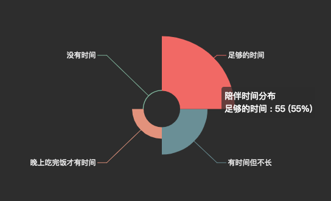
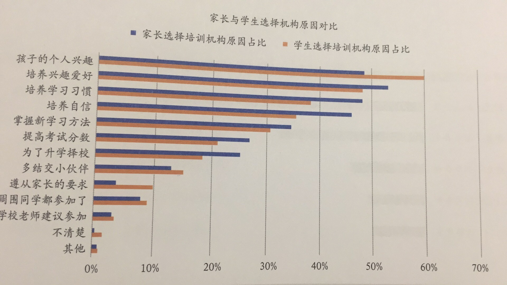
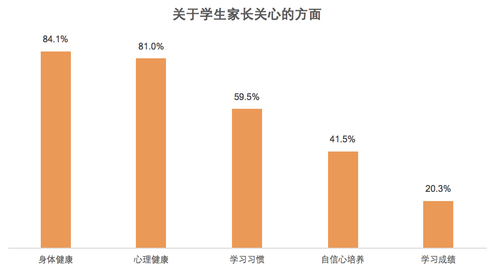
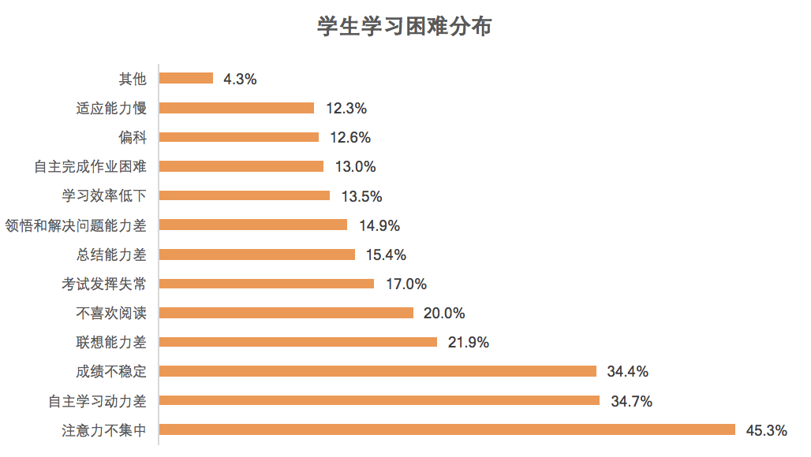
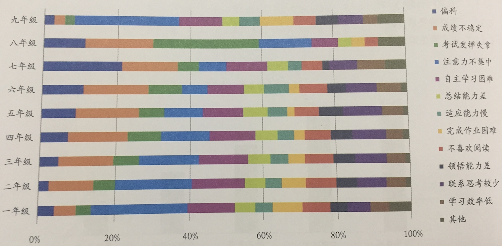
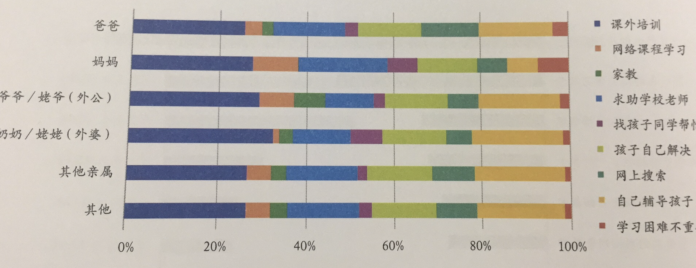

`{r setup, include=FALSE} options(htmltools.dir.version = FALSE) options(servr.daemon = TRUE)`

# 目录

- 用户**现状**

--

- 51talk产品体验流程

--

- 数据产品设计探讨

--------------------------------------------------------------------------------

class: inverse, middle, center

# 以用户为中心

--------------------------------------------------------------------------------

# 用户

- 心中有目标

--

- **脑中有理论**

--

- 手中有资源

--

- **脚下有路线**

???

实际上我们很多用户都是没有目标，或者存在一些伪目标，这是用户的理想状态，那实际情况是什么呢？

--------------------------------------------------------------------------------

class: inverse

## 用户的现状

*

- 学员水平：接近**80%+**都是零基础

- 目标：早期培养孩子的**兴趣**，后期达到**流利交流**的水平

- 家长水平：近**七成**的51talk家长达到本科及以上学历(二三线更低)；

  - 辅导：英文水平越低越关注孩子**知识掌握情况**；

  - 辅导：近**五成**家长关注如何给孩子制定**系统的学习计划**；

  - 教育知识：家长学历越高越关注正确教育孩子的态度和方法；同时也非常关注沟通互动的技巧

.footnote[[*]来自51Talk 2017第二季度用户调研]

???

不会说英语的家长对此问题关注度达到63%，马斯洛需求金字塔，经济基础决定上层建筑，这部分经济水平和自己的水平越低的人更在乎性价比，关注产出，而更高级的人在乎经济建设，非认知类建设

流量下沉的时候，我们应该先产品下沉，保证家长有时间的情况实践成本降低

--------------------------------------------------------------------------------

class: inverse

## 用户决策现状

*

- 最主要是取决于孩子本身的个人兴趣

- 其次是为了培养孩子的个人兴趣

## .footnote[[*]来自2017-2018培训教育年报]

class: inverse

## 用户的现状

- 家长意愿：**72%+**的家长认为家长也需要学习孩子的课程

- 家长时间：接近**90%+**的家长都是有时间陪伴孩子学习

 

.center[]

???

那么对于家长和学员的这个需求现状，零基础的用户究竟应该怎么学，英语分为道和术，那么想要正确的方法必须要坚持正确的道作为参考

--------------------------------------------------------------------------------

class: inverse,middle,center

## 对于一个选消分离的产品，极致的用户体验意味着？

???

转介绍+续费的基础就是极致的用户体验

--------------------------------------------------------------------------------

## 极致的用户体验

- **教学内容好**（教研编排体系、配套内容体系、level等级等）--》让孩子感兴趣，学得会

- **学习效果好**（效果外化）--》让孩子学得好、有成长

- **运营服务好**（解决学员学习和费学习中的诸多问题）--》让家长没有认知负担

- **性价比高**（价格低、老师棒、优惠政策等）--》让家长付出更低成本

- **学习规划好**（有目的，有资源，有路线，有方法）--》让家长无近忧和远虑

- **教育理念好**（有门槛但又不失温度）--》让家长有参与，有成长

--

**老师教得好，学生学的爽，家长有成长**

???

内容、服务、技术

为了某个目的，我需要花多少资源（时间和成本），最适合的是套餐/学习方法什么，是否由之前成功案例，学习体系效果

有门槛但又不失温度（孩子是让父母成长（产品也可以让父母慢慢成为"别人家的父母"）、给父母下指标）

--------------------------------------------------------------------------------

class: inverse, middle, center

# 51talk用户体验流程

--------------------------------------------------------------------------------

# 51talk用户体验流程

- 新用户

  - **预约**体验课(自约或代约) -> **出席**体验课 -> FT课后**测评**

- 新付费用户

  - 预约**第一节付费课** -> 课前**预习** -> **出席**付费课 -> 课后**复习**、作业

- 老付费用户

  - **约课** -> **测评**（单元测评、level提升测试等、口语测评、自然拼读测评、阅读能力测评）

--------------------------------------------------------------------------------

class: inverse, middle, center

# 新用户的极致用户体验

--------------------------------------------------------------------------------

## 新用户数据化产品

- 体验课选择时间+教材匹配，但教材难度如何对应如何匹配学生真实水平？

  - placement test：i+1理论，太简单的往往不会付费，**course_level>=true_level可以提升付费率** @教研+大数据

  - **兴趣**调研：语言与认知水平一致 @大数据

- 上课体验更佳

  - 用户信息调研（学员年龄、学习目的、学员兴趣、家庭基本情况、时间和教育经费支出、学习场景以及学员性格、学员动机、学员习惯、学员意志力、学员理解力等），产生学员画像（外教老师、CST、CC、分析人员等消费），首次信息采集后，后期的所有学员反馈信息.orange[用户信息系统] 中打通，CC或CST等直接接触用户的部门可以调用 @大数据

--------------------------------------------------------------------------------

## 新用户数据化产品

- 课后决策输入（For CC）

  - 孩子上课的**兴趣度**，整体感受（在前面两步中解决）

  - **师资**（可以优选）

  - **学习效果**（根据不同的学习目的+学习时间频次，给出相应的成长曲线）@大数据

    - 教材匹配度：教材与各个学校授课教材的衔接度+匹配度 @教研

  - **价格**（超高性价比如何来：个性化的优选老师推荐、配套的内容体系、学习规划、育儿理念、学习方法等）@大数据+教研

  - ~~测评是否权威~~

--------------------------------------------------------------------------------

## 家长选择机构原因是？

.center[]

--------------------------------------------------------------------------------

class: inverse, middle, center

# 新付费学员的体验流程

--------------------------------------------------------------------------------

## 新付费学员的体验流程

- 课前约课（First)

  - 老师**偏好画像**调研，比如偏好的外教性别、教学经验、口音等，在.orange[用户信息系统]中产生和消费 @大数据

  - **老师推荐**（冷启动）：

    - 基于优质老师推荐：**glicko+bpr**排名top200，**过滤**学员level+学员老师偏好画像推荐，一键**+收藏**

    - 基于**slot**的推荐

    - 如何约课+上课+回放+反馈 demo（课后看**回放**，遇到喜欢的老师**评价**yes，在哪里**投诉**，绑定服务号接收个性化内容） @教研+大数据

--------------------------------------------------------------------------------

## 新付费学员的体验流程

- 课前预习

  - 课前教材**中英文**版本（针对青少家长零基础看不懂，无法帮助孩子预习）@教研

  - 课前**预习动画** @教研

  - unit课前个性化**配套资源**（动画片、儿歌、绘本、内外部资源）+ 跟踪反馈，在预约这个unit的第一节课后就开始推送 @大数据+教研

  - **课堂用语**动画（针对低龄学员听不懂、没反应等现状），这个在第1月都需要推送 @开发+教研

- 上课

  - 课前**2h**提醒上课（内容+心态+时间）、**未出席3min**进行电话或者短信提醒

  - 绘本课/中教复习课**课前提醒**，目前产品这两块都没有

--------------------------------------------------------------------------------

## 新付费学员的体验流程

### 课后作业

- 课后作业现有（线上10题+PDF版）：是否完成作业（当天课后半小时提醒）

- 课后作业待选

  1. 低年级口语作业**role-play或activity**，理解能力的迁移和反馈，这部分可以参考English Sing Sing的对话，设计反馈体系，提交作业到微信（后期考虑产品）并完成反馈（通过CST发送给家长或者CST主动询问的方式进行帮助填写反馈表）

  2. 高年级家长更在意笔头内容：CST按照**语法点+核心句型**出题，需要一个不同level-unit-course的**题库**，每日一练反响很好@教研设计题库，大数据负责数据的收集和反馈跟踪（比如在知识点上的掌握程度），这部分作业必须**线上化，知识点结构化**。题库录入和题库消费都在一个系统

--------------------------------------------------------------------------------

## 新付费学员的体验流程

- 课后报告

  - T+1课堂**回放**(营销人员）：**主观观察**(上课状态存在的问题）+ **客观表现**（上课学生老师交互图、出席情况、网络情况、课后评价情况、课后完成作业情况)

  - T+1**学习报告**（学员） ：基于course的知识点（单词、语法、句型）+技能掌握报告（老师对学院的语法点、知识点

  - 老师评价：中英文翻译功能，低龄以及低水平家长看不懂

- 学习**规划**

  - 预约课程：根据学院学习目的、学习可用时间，预约一个unit课程（CST），@大数据：根据不同的学习目的+学习频次，给出相应的成长曲线

  - 学习方法指导（服务号接口，个性化发送；或在CMS内容消费接口服务CST、CC）：根据课堂中孩子出现的问题进行针对性的发送

  - 家长理念指导（CMS系统录入和消费）

--------------------------------------------------------------------------------

class: inverse, middle, center

# 付费学员中期体验流程

???

## 感知最多的是约课、上课、效果

## 付费学员中期体验流程

- 约课：如何预约合适的优质老师(**家长**)

  - 约课攻略（doing）、个性化外教推荐（BPR+Glico doing）

  - 单元复习课约课（待定，目前由CST运营安排）

- 持续的**学习规划**(孩子+家长)

  - level-unit的单元规划(doing)

  - level的约课计划(to do)

  - 零启蒙的学员周计划doing)

- 学以致用（基于节假日的场景主题推送）

  - 除CEJ外资源：增加使用场景，各种节假日、各种季节资源（春季放风筝、夏天游泳、夏令营等）以及生日相应的学习资源；

--------------------------------------------------------------------------------

## 家长主要关注孩子的方面

*

.center[]

.footnote[[*] 2016-2017教培行业调研] ???

## 而在学习这块，学员主要存在哪些问题呢？

## 付费学员存在的问题分布

*

.center[]

## .footnote[[*] 2016-2017教培行业调研]

## 付费学员不同年龄的问题分布

*

低年级主要表现为**注意力不集中**和**自主学习困难**，而越往高年级是**偏科**和成绩**不稳定**

.center[]

.footnote[[*] 2016-2017教培行业调研]

???

初中开始后，注意力越来越不集中，偏科也越来越少。

--------------------------------------------------------------------------------

## 付费学员存在的问题解决分布

所有人都偏向于通过**课外培训**解决问题，其次是自主辅导，再然后是求助学校老师

 

.center[]

???

母亲相比父亲更爱求助学校老师，而不爱自己辅导孩子，同时母亲多半认为学习困难不重要。

老一辈人也更偏向于自己辅导孩子，而不求助学校老师

--------------------------------------------------------------------------------

## 付费学员中期体验流程

- 学习过程中的问题（**家长**)

  - 问题范围：理解力（听不懂、读不懂）、意志力（情绪调节，心理健康）、学习习惯（注意力不集中）、学习动机（内驱动力不足）、学习兴趣、身体健康（运动类）等

  - 解决方案：

    - 产品化：CMS家长文章内容体系推拉（文章标签包含儿童多方面素质的培养），内容产生和消费（CC/CST/教研/运营等）

    - KOL直播：家长学院

    - 家长说：UGC内容整合入口（收集效果top20%的家长或有优秀育儿经验的内容体系，可以是活动H5页面），分年龄、问题、level、城市等

--------------------------------------------------------------------------------

## 付费学员中期体验流程

- 效果外化

  - 每个unit的**单元报告**（课堂输出成长曲线、知识点掌握情况）

  - 周、月度个性化报告：约课习惯、成长曲线、知识点掌握、进步点（温馨关怀：1月、3m，6m，具体进步点进行推送鼓励）

- **单元unit测评**（包含知识点掌握和技能掌握）：

  - **外教课**测评：每节课老师提问教材中答题正确率（对应到知识点）或技能（输出）测评；因外教老师存在帮助用户选择的情况，最终的结果都是正确的，因此这部分需要对老师进行标准化培训，才可能做到较好的测评。

    - 中教**复习课**测评：续费CST与UR老师信息非同一人，造成信息损失，复习课老师无法准确的对多人进行评估（结构化的信息可以评估，用户、课程、知识点、知识点掌握打分）

  - **单元知识点**测评：基于知识点（单词、语法、句型）的单元测试题，测评基于题库（.orange[题库管理系统])

--------------------------------------------------------------------------------

## 付费学员中期体验流程

- 其他测评

  - 口语水平测试

  - 自然拼读能力测试

  - 阅读能力测试

  - level升级测试（整个level的知识点测评，先做初版，在做自适应）

--------------------------------------------------------------------------------

class: inverse, middle, center

# 线上线下融合的教学服务体系

???

目前线上线下的结合仍然在物理性的简单拼凑，尚未形成化学式的真正融合，但这是必然趋势，可以大幅度降低教师工作量提升教学效率

--------------------------------------------------------------------------------

## 线上线下融合的教学服务体系

### 教师的工作范围

- 全产业链：教研-教学-学习-测评-家校互动

- CST教学相关工作：

  - 自主录题

  - ~~编制教材~~

  - 学情跟踪

  - 课堂评价

  - 班级管理

  - **在线作业生成和测评**、学员课后自主练习（微信公众号？）

  - 家校互动（家长反馈纳入.orange[用户信息系统])

--------------------------------------------------------------------------------

## 线上线下融合的教学服务体系

### 基于教学指向的**营销**产品

- 学员分组：新购学员、到期学员、其他期学员

- 学情表现

  - 学员**学情**：隐性数据：出席率（一对一，复习课、绘本课），设备网络情况，约课行为，yes率(投诉率、评价差评率），课中积极答题率（小孩子不会用，老师帮助点，如何评估，由老师？）,课前预习和课后习题完成率+ 显性沟通（用户反馈数据入口）

  - 学员**频次**：上课频次

  - 学员**效果**：课堂输出率（等级）、知识点掌握报告

  - **有效**学员：课程何时到期

--------------------------------------------------------------------------------

## 线上线下融合的教学服务体系

### 培养学员的**粘性**

- 基于城市或level的学员标杆活动（优秀的奶牛产奶，分享赠孩子喜欢的东西或者赠课）

- app打卡（每日app打开等进行相应的积分奖励，积分可以兑换玩具、书籍等）

- 完善的积分产生和消费体系：跟学习活动相关的都计入（绘本课预约、复习课出席、作业完成等，家长和学员一起挣积分，给家长和孩子分别定目标）

--------------------------------------------------------------------------------

class: inverse, middle, center background-image: url(<https://upload.wikimedia.org/wikipedia/commons/3/39/Naruto_Shiki_Fujin.svg>) background-size: contain

## 极致的用户体验=老师+**内容**+**服务**+**技术**(测评/推荐/反馈）

--------------------------------------------------------------------------------

# 用户需求 VS **数据产品规划**

.pull-left[

1. 心中有目标(教学)；

2. 脑中有理论(启蒙)；

3. 手中有资源(学习)；

4. 脚下有路线(单元/周计划)；

5. 嘴上有反馈(内容) ]

.pull-right[

1. 内容构建(CMS/题库)；

2. 产生机制(教研/CST/CC/运营...)；

3. 内容消费(App/微信群/服务号.)；

4. 内容输出(课程)；

5. 内容反馈(课程/单元/周/月)

]

--------------------------------------------------------------------------------

class: center,middle,inverse

# **无设计，不BUG**

--------------------------------------------------------------------------------

# 数据化产品基础

- **用户**：信息系统，包含注册和基础数据采集(家长和学员)

- **内容**

  - **资源**：内容数据层，包含内部和外部的音频、视频、绘本、家长实践指南和启蒙理论文章以及题库内容

  - **理论**：内容架构层：主题螺旋系统的设计(Bloom分层教学法)、标签Tag体系设计、Grammer知识点体系设计、逆向教学设计法、二语习得

  - **路线**：内容消费层，单元/周计划的制定（教研），根据单元主题自动可以匹配到已有的内容

  - **测试**：消费题库内容，决定用户应该消费什么内容，基础的course/unit/level测试和相关测试（reading/Listening/Phonics)

- **反馈**：所有跟学员学习媒介相关反馈（CC、CST、家长、外教、作业等）

???

## 讲一下我们的反馈体系的设计，five little monkeys

class: center, middle,inverse

# Any Question

## **renwanfeng@51talk.com**
