```{r setup, include=FALSE}
options(htmltools.dir.version = FALSE)
options(servr.daemon = TRUE)
```

# 目录

- 我们做了哪些教学闭环产品

--

- 我们踩了哪些坑？

--

- 如何培养自己成为敏捷数据科学家

---
class: inverse, middle, center

# 51Talk是做什么的？

---
class: middle, center
background-image: url(pic/51talk.png)
background-size: 200px
background-position: 90% 5%

<blockquote>2016/06, 51Talk登录美国纽交所</blockquote>

<blockquote>青少、成人、班课三条业务线，青少为主</blockquote>

<blockquote>教师超过<b style="color:orange">20000</b>名外教，录取率仅为3%</blockquote>

<blockquote>基于孩子语言发展规律自主研发的Classic English Junior</blockquote>

<blockquote>自主研发AirClass学习平台，适配多端，每天超 80000节课</blockquote>

---
background-image: url(pic/user_map.png)
background-size: contain

## 51Talk学员分布

---
## 管中窥豹

### 注册-->预约体验课-->预习-->上课-->课后-->辅助

<video width="600" height="400" controls="controls" autoplay="autoplay">
  <source src="pic/1853.mp4" type="video/mp4" />
  </object>
</video>

---
class: inverse, middle, center
background-image: url(https://upload.wikimedia.org/wikipedia/commons/3/39/Naruto_Shiki_Fujin.svg)
background-size: contain

## 我们做了哪些教学闭环产品

???

公司那么多可做的点，为啥我们就选择了做教学产品呢？这不是产品应该或者教研去规划的事儿？

---

# 基于ToB and ToC 的教学产品

- 约课攻略(To C)

- 个性化学习计划(To C)

- 个性化单词本(To C)

- 魔镜系统(To B)

???

我们之前也走过的弯路，关注数据赋能营销,但这些看起来能看到钱的技巧却不是教育的本质，教育不是付费转化率，是教书和育人。而教书也不是知识的传递，而是如何帮助学生构建这个知识体系，最后掌握对应的知识和技能，而同时我们也需要关注如何教育人成为人的这个话题。如果我们没办法做到这两点就没法提升续班率，转介绍率，和付费转化

---

## [约课攻略](http://junior.51talk.com/Mobile/Activity/appointStrategy/?uid=22883392230#/)

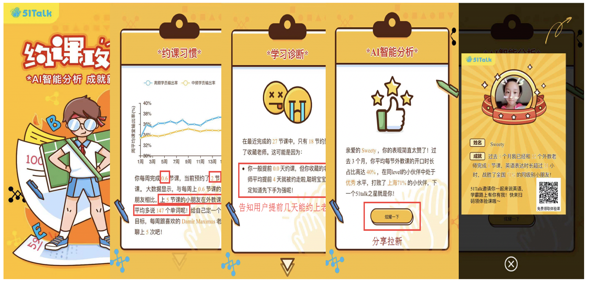

???

为何选择做约课攻略，从业务流程来看，学员上课必然之前会涉及到约课的环节，而没有约到心动的老师，可能上课的效果就会打折扣，特别是对于青少来说，对陌生的老师需要有很长的适应过程，因此如何能保证用户在约课的时候都能尽量约到自己收藏的老师，是我们需要尽力去优化的指标，而从数据上，我们也可以做佐证这一点，尽量多的选择到自己的收藏老师，使得后期老师评价率更为正向，且对学员的课耗有着正向促进作用。
因此我们在整个约课攻略的产品中，主要关注核心点是约课体验、其次是教学效果；比如这个学员约课不好的，但是学习效果不错的，我们会告诉他为何自己约不上好老师，自己差在什么地方怎么改进，而学习效果不错的，我们可以直接促进转介绍的分享。

，

---

## [约课攻略case](http://junior.51talk.com/Mobile/Activity/appointStrategy/?uid=22883392230#/)

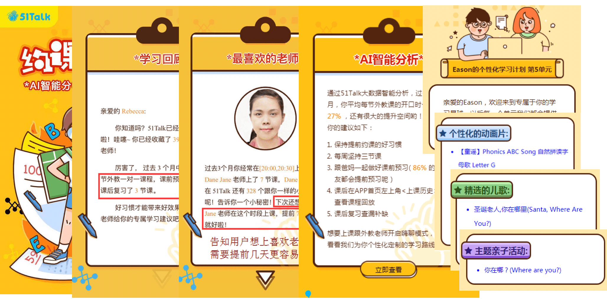

???

而有的学员约课体验较好，但是学习效果不够好的，我们就会告诉他在约课的现状，以及跟最喜欢的老师建立连接，怎么去预约到最喜欢的老师，而学习效果不好我们也会给出对应的个性化学习内容

---

### **约课攻略**的背后我们经历了什么

- 大数据：为啥要做个性化的约课攻略？大数据发起？

- 产品：我要来写这个PRD？不存在的

- 前端开发：我们做不了这种个性化模板

- 运营： 这文案我们也不知道咋弄啊

--

.center[**大数据负责产品PRD、后端个性化文案、前端demo、产品推广和培训**]
.center[]


---
### 约课攻略的推广我们经历了什么

- 服务营销端在双11专项推送

- CEO各个大会PR

- 内部培训多场

<br>

--
.center[**约课攻略的产品生命周期决定了它的结果**]

.center[]

???

翻车现场

---

## [个性化学习计划](http://enlighten.51talk.com/peasonalized_target?uid=39946600&level=0&unit=6&name=Baby&sig=229420bb3cf3f3d05ce8b33a95bac8a162d0d345)

.center[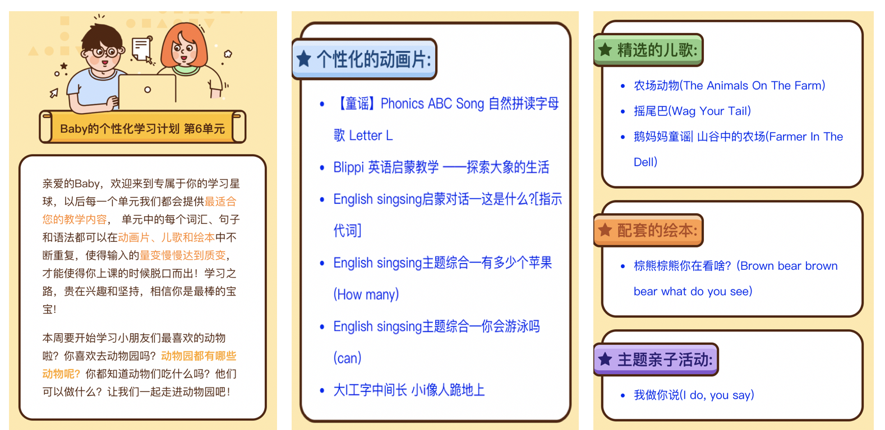]


???

而个性化学习项目，比约课攻略项目开启的更早。主要是结合学员当前所学的单元以及知识点，匹配对应的学习内容，为何有这样的想法呢？
因为在市场调研中，家长比较在意孩子的知识点掌握情况以及如何给孩子制定学习计划，而目前的英语学习启蒙产品或者在线教育中，基本都没有这个环。因此我们也开辟了在线英语赛道第一个给学员个性化学习计划的公司，而学员的反馈都较好
---
## [个性化单词本](http://enlighten.51talk.com/resource/wordunit_v2?uid=239626986&unit_type=last)

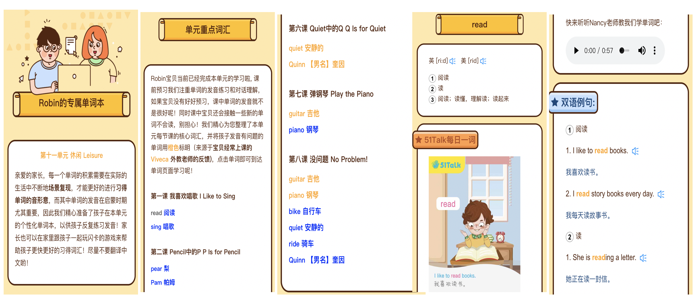

???

我们在提供个性化学习计划，主要是教学内容相关的动画、儿歌、绘本、亲子活动相关，这些都属于启蒙类的语音和场景输入，跟知识点直接关联性不够强，因此在我们的教学体系中，为了找到给到学员对知识点的掌握情况，并且查漏补缺，直接提升学员的学员效果

而这些项目都是单点突破，开发出来后，没有具体的载体帮助推广，最后就可能死于襁褓中。而约课攻略的推广也不是在app体系，而是在CRM体系，需要sales发送给用户，这就是教育跟其他互联网行业不太一样的地方，家长信任人多于产品体系，且都需要课程顾问的解释，因此他们建立了一个强纽带关系


---
### 个性化单词本的背后我们经历了什么

1.lesson memo数据全是非结构化的，怎么办？

--

- **不被设计的数据基本不叫数据**

--

2.单词本我们究竟要提供多长时间维度的？

--

- **结合服务/学习周期才是最适宜的**

--

3.我们应该提供哪些维度给学员？

--

- **符合孩子大脑信息处理的图片、发音、英文例句和场景**

--

4.一词多意怎么办？

--

- **给不大于孩子当前英语水平的中文意思**

---

## 魔镜系统背景

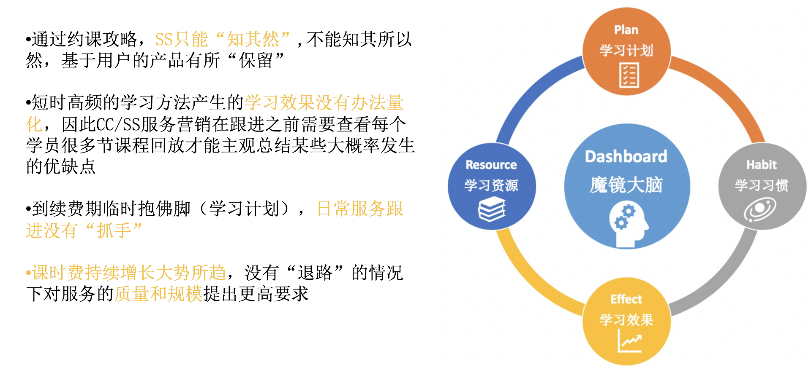


???

我们通过数据的整合，场景和教学的设计，以及对教学本质的深刻思考，设计了一个基于大数据的营销服务平台- 魔镜系统，而魔镜系统的诞生最主要还是因为约课攻略推动艰难，用户覆盖度上不去，当家长和课程顾问没有信息剪刀差时，服务就很难做，因为没办法体现出你的权威专业，很难建立这一层信任

---

## 魔镜大脑一分知用户

<br>

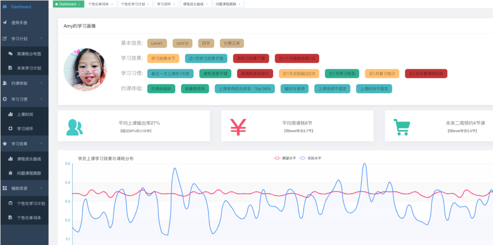

???

比如我们整个体系覆盖了学员的魔镜大脑页面、以画像的形式给到课程顾问最直接的展现，通过一分钟，我们就能知道学员的基本信息、学习效果和学习习惯和约课体验。

---

## 魔镜学习效果课课跟踪

<br>

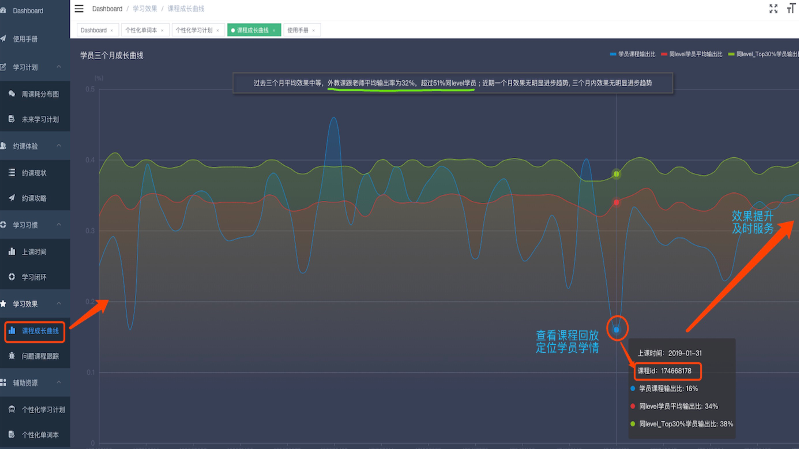

???

再比如我们关注学员的学习效果，而学员的学习效果是否提升，学员的成长曲线如何，在什么时间点提升，哪些课程没有上好，

---

## 魔镜问题课程清晰可见

<br>

.center[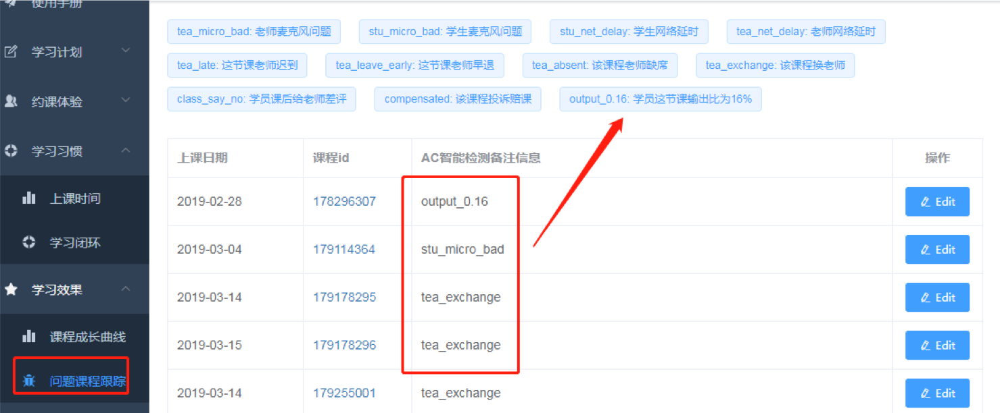]

???

没有上好的课程是外部设备、网络影响还是主要自己水平能力问题，这些我们都可以在魔镜找到答案。

---

## 魔镜学习闭环有数可依

<br>

.center[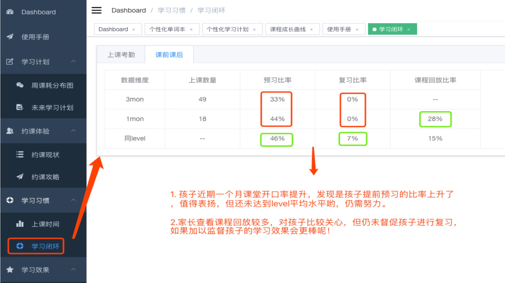]

???

而学习效果好不好跟整个学习闭环做的好不好都有较大的关联，比如我们的学员的预习、复习、课程回放、学员的学习习惯（考勤）都有较大的关系

---
## 魔镜辅助资源助力效果

<br>

.center[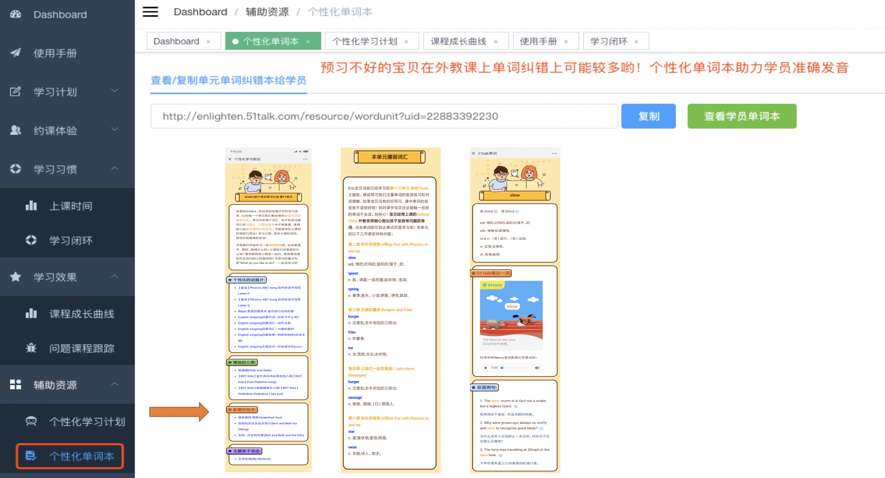]

???

那么针对学员学习效果不好的，我们不仅仅是诊断即可，我们也需要对症下药，这样才能真正改变结果，使得学员的学习效果得到提升，因此我们整合了单词本、个性化学习计划、以及正在筹备的一些教学产品，都会在这个版块来直接助力学习效果

---
## 魔镜落地效果

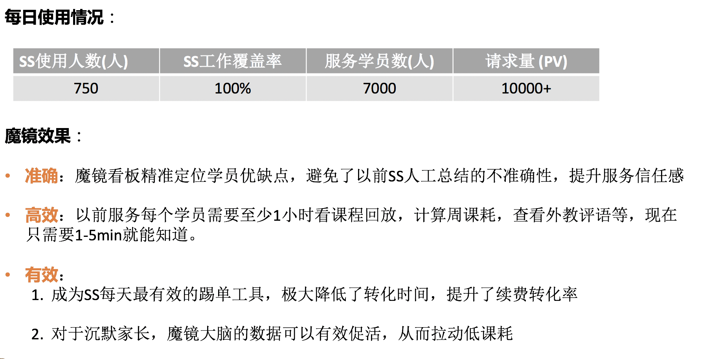

???

那么这样的一套系统，出来后结果如何呢？我们逐步覆盖了100%的SS的工作，每天可以服务7000+的学员，每日请求超过1W，而就是这样的一套魔镜系统铸就了SS服务的准确、高效和有效。但


---

### 魔镜系统成功的背后又有哪些坑？

- 各端**认知**完全不在一条线

- 业务**数据**基本没有被设计，想要的核心数据没有，有的也是非标准化的

- 前端没**资源**、产品/ui设计没资源

- 当你没把产品给到她面前，你永远不知道她到底想要什么

<br>

--
.center[]

???

魔镜最开始开发的背后，我们面临着这样一些尴尬的境地，没有产品没有前端没有设计，我们最富有的就是只有一些不健全的的数据，我们能做什么东西吗？没有资源我们可以创建资源、没有环境就自己上，没有营销服务人员的支持，我们就按照学员生命周期的流程逻辑来构建，而这就是当你没把产品推到服务人员面前的时，他也不知道这东西是如何的awesome！不知道自己可以这样的服务学员

---

### 魔镜的实际推广


- **设计**：我们设计了一个基于大数据智能的学员学情管理平台（**是改变还是幸福的改变？**）

- **试跑**：营销服务人员不要给我们增加负担，我们每天的工作就很累了

- **上线**：这么复杂的系统服务人员根本不会用的，你要简单到他们只需要托拉拽即可

- **理想场景**：我们希望营销服务人员能通过这些智能数据生成个性化的话术

- **实际场景**：以最快的速度把魔镜大脑截图发给学员家长、得到有效反馈后、主动写使用心得和手册、迅速在组内和组外推广

???

而当我们一步一步从开始的设计到产品demo试跑，就遇到了比较大的障碍，当时正在推广一个服务营销的工作台，他们称这个完全是基于课程顾问的工作SOP来做的，也得到了大多数人的认可，因此服务营销的负责人断定，基于他们的水平，像我们这种那么复杂的数据系统，SS是很难看懂的。且在试跑中也会增加他们负担，了解新东西的成本，以及建立信任比较难的，因此我们必须要是一个幸福的改变而不只是改变。

但从试跑到上线，他们仍然以最快的速度去体验，去发截图给家长，写组内的使用心得退关。


马云建立了无人超市，记者问大妈的看法：

大妈： 超市都没人了，还不得关闭
记者：不是没有人，而是没有售货员和收营员
大妈：那应该叫无员工超市，那么超市都不雇佣员工了，是不是更便宜了？
记者：这个并不了解
大妈: 老百姓只关心超市离得进不进，有没有假货，是不是便宜，你超市有无员工跟我有啥关系
记者：你是不是对马云有啥误解
大妈：马云的确从某些程度改变了我们的生活，但是我们要的不是改变，而是幸福的改变


---
class: inverse, middle, center
background-image: url(https://upload.wikimedia.org/wikipedia/commons/3/39/Naruto_Shiki_Fujin.svg)
background-size: contain

## 踩坑无数，生命不息，前行无阻

???

刚才所有看到的产品都是1-2个人完成，你可能会认为这是创业公司的做派，大公司一个螺丝一个钉，没办法施展拳脚，但是当你的认知远超其他团队时候，你的手和脑也会有自己的想法，因此下一part我们会讲到在现有的一些公司现状以及如何培养自己能够完成从数据到产品的成功落地，而这其中是怎样的一个过程。

---
class: inverse, middle, center
background-image: url(https://upload.wikimedia.org/wikipedia/commons/3/39/Naruto_Shiki_Fujin.svg)
background-size: contain

## 如何培养自己成为敏捷数据科学家

---

### 如何培养自己成为敏捷数据科学家


- 主动出击的 **数据思维**

- 价值升维的 **产品思维**

- 从0到1的 **全栈** 技能

- 把臭豆腐盘活的 **运营能力**（影响力）


---
class: inverse, middle, center

## 主动出击的数据思维

### 行研报告先知道

### 公司业务挖核心

### 无中生有得数据

???

大家经常会接到各种业务方的需求，因此被迫的做着一些自己并不感兴趣也没有激情的活儿，但这时候有没有问自己，你是否比业务方更懂这块的数据。这个业务应该看什么数据，我们现在应该做这个需求吗？她关注的是不是公司关注的指标等等

---
### 主动出击的数据思维 **行研报告先知道**

<br>

- 行研报告：Questmobile、36kr、Trustdata、教育行业报、AIMSEN行研等

- 公司内部调研数据

- 公司核心业务数据现状

---
### 主动出击的数据思维 **公司业务挖核心**

<br>

1. 找到核心业务的KOL

2. 取经成功的秘密武器

3. 秘密武器是否能自动化

---
### 主动出击的数据思维 **公司业务挖核心**

<br>

  1. 低年级口语作业**role-play或activity**，理解能力的迁移和反馈，这部分可以参考English Sing Sing的对话，设计反馈体系，提交作业到微信（后期考虑产品）并完成反馈（通过CST发送给家长或者CST主动询问的方式进行帮助填写反馈表）

  2. 高年级家长更在意笔头内容：CST按照**语法点+核心句型**出题，需要一个不同level-unit-course的**题库**，每日一练反响很好@教研设计题库，大数据负责数据的收集和反馈跟踪（比如在知识点上的掌握程度），这部分作业必须**线上化，知识点结构化**。题库录入和题库消费都在一个系统
  
  3. 单元复习课是有力抓手
  
  4. 打电话靠干讲，没有可视化的素材
  
---
### 主动出击的数据思维 **无中生有得数据**

<br>

1. 没有数据：.orange[内部自流通采集]

2. 没有数据：.orange[自己动手产生？]

3. 没有数据: .orange[爬虫(在法律边缘试探)]

???

没有任何公司数据可以参考

---
### 主动出击的数据思维 **无中生有得数据**

搞清楚内部业务数据流通闭环助力数据的采集

.center[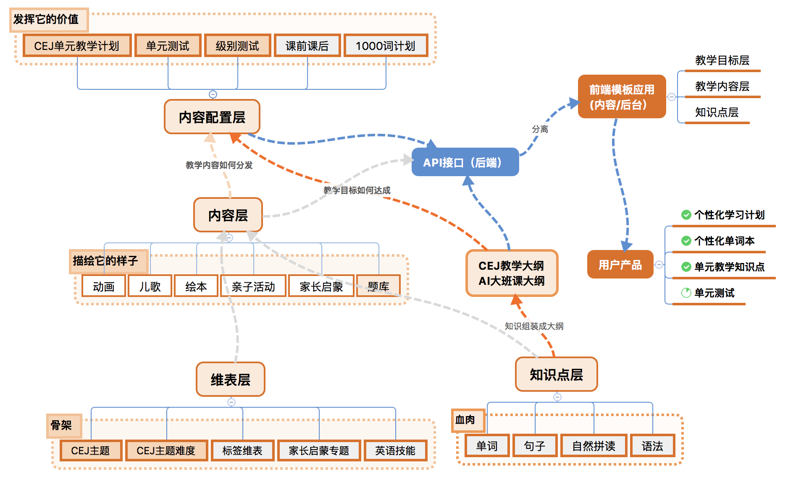]


---
### 主动出击的数据思维 **无中生有得数据**

#### 没有外部数据如何弥补认知遗漏

<br>

.center[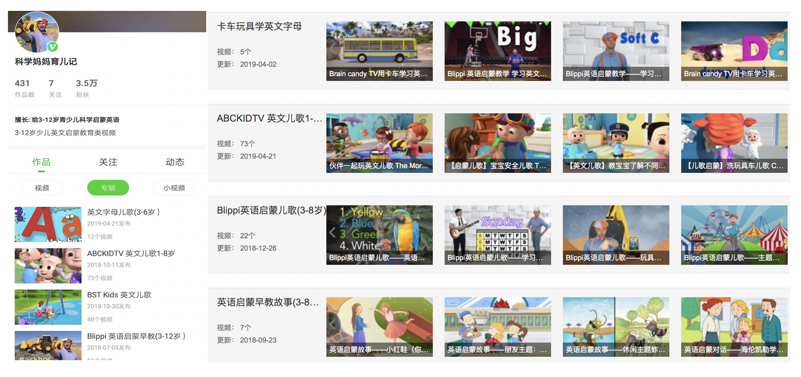]

---
### 主动出击的数据思维 **无中生有得数据**

#### 外部数据找insight

.center[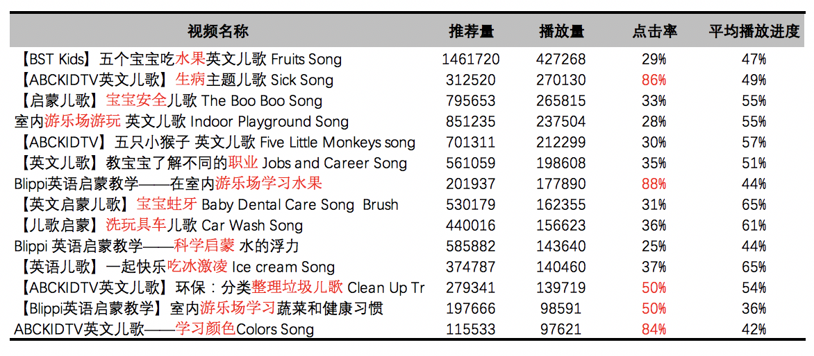]

---
### 主动出击的数据思维 **无中生有得数据**

#### 外部数据找本质

.center[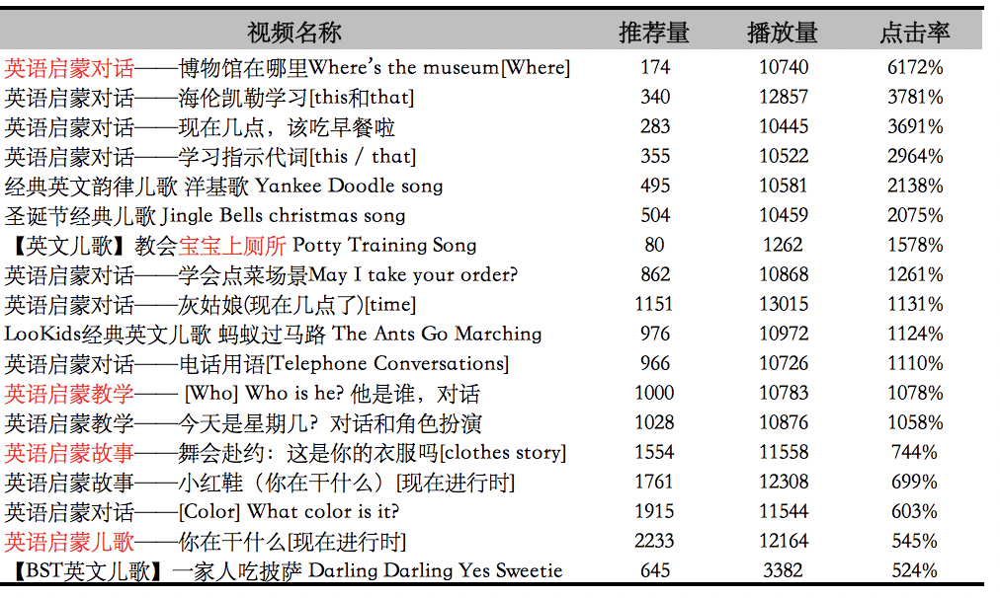]

---
class: inverse, middle, center

# 价值升维的产品思维

### 产品切入点

### 用户洞察

---
### 价值升维的产品思维  **产品切入**

<br>

- 从本质思考(怎么学、怎么教、怎么测)

- 从重点思考(怎么学、怎么测)

- 从上层思考(内容、教师、反馈(数据))

---

### 价值升维的产品思维  **如何从本质思考** 

<br>

- **教学内容好**（教研编排体系、配套内容体系、level等级等）--》让孩子感兴趣，学得会

- **学习效果好**（效果外化）--》让孩子学得好、有成长

- **运营服务好**（解决学员学习和费学习中的诸多问题）--》让家长没有认知负担

- **性价比高**（价格低、老师棒、优惠政策等）--》让家长付出更低成本

- **学习规划好**（有目的，有资源，有路线，有方法）--》让家长无近忧和远虑

- **教育理念好**（有门槛但又不失温度）--》让家长有参与，有成长

--

<br>

**老师教得好，学生学的爽，家长有成长**

---
## 价值升维的产品思维  **用户洞察**

<br>

- 从数据知用户（参考行研报告）

- 从本质知用户（用户心理学）

- 从工具知用户（墨刀、processon、Axure...)

---
class: inverse

### 价值升维的产品思维  **用户洞察**

#### 从数据知用户<sup>*</sup>

- 学员水平：接近**80%+**都是零基础

- 目标：早期培养孩子的**兴趣**，后期达到**流利交流**的水平

- 家长水平：近**七成**的51talk家长达到本科及以上学历(二三线更低)；

  - 辅导：英文水平越低越关注孩子**知识掌握情况**；

  - 辅导：近**五成**家长关注如何给孩子制定**系统的学习计划**；

  - 教育知识：家长学历越高越关注正确教育孩子的态度和方法；同时也非常关注沟通互动的技巧

.footnote[[*]来自51Talk 2017第二季度用户调研]

???

不会说英语的家长对此问题关注度达到63%，马斯洛需求金字塔，经济基础决定上层建筑，这部分经济水平和自己的水平越低的人更在乎性价比，关注产出，而更高级的人在乎经济建设，非认知类建设

流量下沉的时候，我们应该先产品下沉，保证家长有时间的情况实践成本降低
---
class: inverse
### 价值升维的产品思维  **用户洞察**

#### 从数据知用户

- 家长意愿：**72%+**的家长认为家长也需要学习孩子的课程

- 家长时间：接近**90%+**的家长都是有时间陪伴孩子学习

.center[]

???

那么对于家长和学员的这个需求现状，零基础的用户究竟应该怎么学，英语分为道和术，那么想要正确的方法必须要坚持正确的道作为参考
---
### 价值升维的产品思维  **用户洞察** <sup>*</sup>

低年级主要表现为**注意力不集s中**和**自主学习困难**，而越往高年级是**偏科**和成绩**不稳定**

.center[]

.footnote[[*] 2016-2017教培行业调研]

???

初中开始后，注意力越来越不集中，偏科也越来越少。
---

### 价值升维的产品思维  **从本质知用户**

.pull-left-item[

- 儿童心理学

- 发展心理学

- 认知心理学

- 教育心理学

- 蜥蜴法则

- 让孩子主动学习的60招

- 追求理解的教学设计

- 用户思维：好产品让用户为自己尖叫]

.img-right[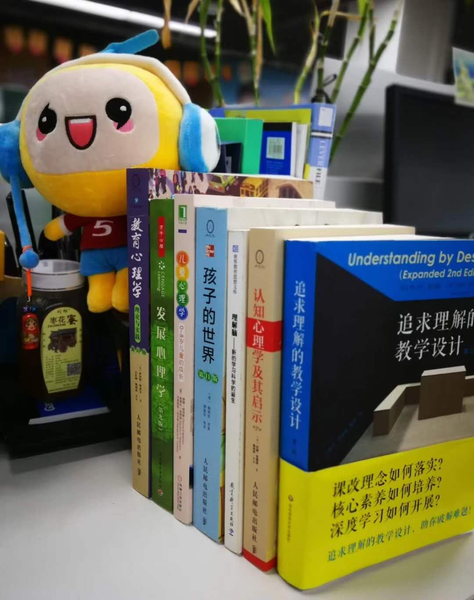]


---
class: inverse, middle, center

# 从0到1的全栈技能

---
## 从0到1的全栈技能

<br>

- 从开发到上线(特征工程能力、模型能力、AB test流量分配、自动化部署上线ansible/ansible-playbook/python uwsgi/Nginx)

- 后端接口(python: Django/Flask  R: Rest API (plumber/opencpu))

- 前端技术基础(**Vue.js** /Angular.js/HTML/CSS/Vuex.js、埋点)

- 前端技术框架(**VueElementAdmin**、vuetify-material、Vue-beauty、Anti design)

---
class: inverse, middle, center

## 把臭豆腐盘活的 **运营能力**

???

同志们：别炒股，风险太大了，还是做豆腐最安全！做硬了是豆腐干，做稀了是豆腐脑，做薄了是豆腐皮，做没了是豆浆，放臭了是臭豆腐！稳赚不亏呀！   ----冯巩

--

### 如何定义你的用户喜欢你的产品

--
### 如何盘活你的产品

---
### 把臭东西盘活的 **运营能力**

#### 如何**定义**你的用户喜欢你的产品

- 有多少人在使用

- 每天使用产品的频次

- 哪些功能用户经常在使用

- 这些人使用产品都为哪些人服务

- 服务的这些人是否达到了预期设计


---
### 把臭豆腐盘活的 **运营能力**

#### 如何盘活你的产品: **调动参与感**

找到KOL组试跑MVP，每天及时反馈和参与迭代设计，并及时撰写相应的服务使用手册

<br>
.center[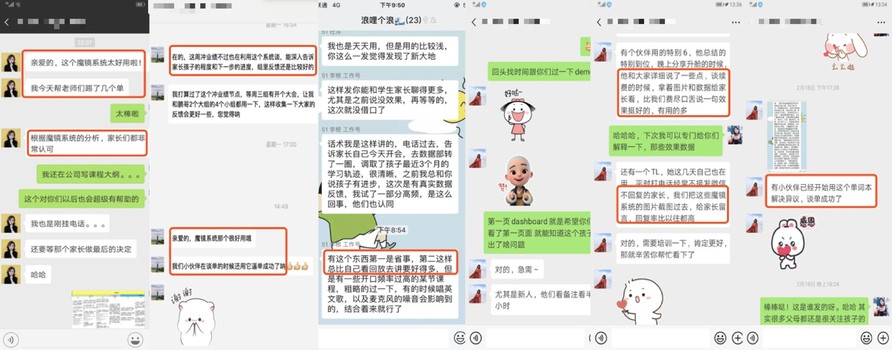]

---
### 把臭豆腐盘活的 **运营能力**

#### 如何盘活你的产品: **假设自己是一个用户**

<br>

.center[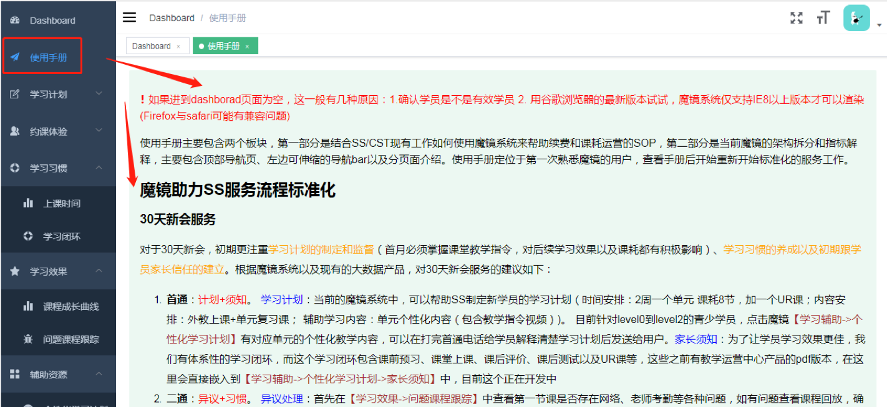]

???

产品一开始出来，可能大家都不知道；应该如何使用这个产品，因此产品结合服务工作的SOP必不可少

---
class: inverse, middle, center
background-image: url(https://upload.wikimedia.org/wikipedia/commons/3/39/Naruto_Shiki_Fujin.svg)
background-size: contain

## 成为敏捷数据科学家的路线是？

--

### 做数据里面有**数据架构**思维的

--

### 做数据架构里面有**产品思维**的

--

### 做产品里面最懂**前后端**开发的

--

### 懂前后端开发里面最**懂用户**的


---
class: center, middle,inverse

# Any Question

## **renwanfeng@51talk.com**
---
