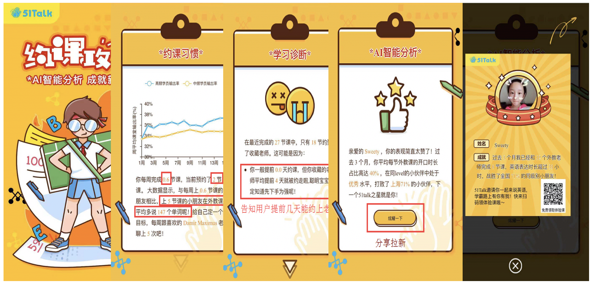
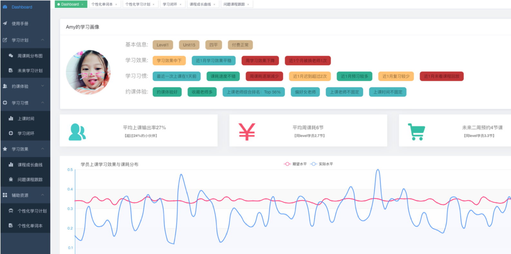
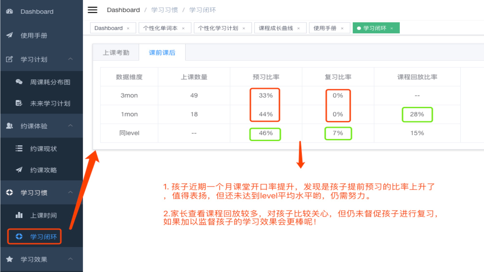
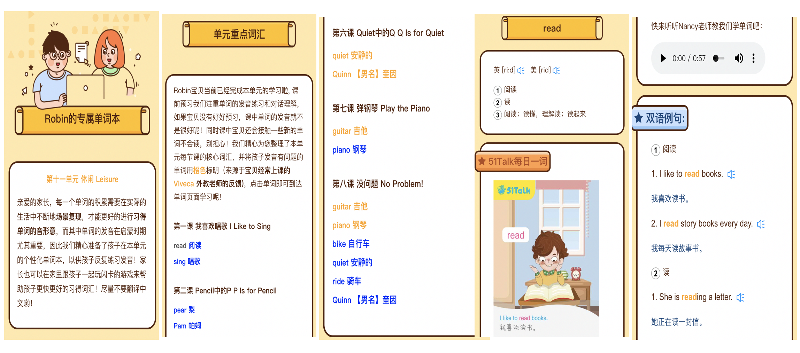
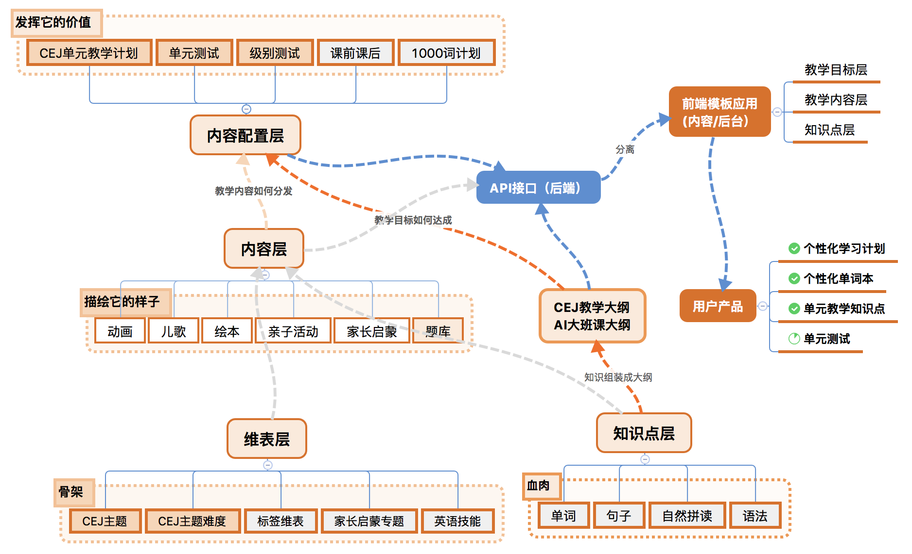
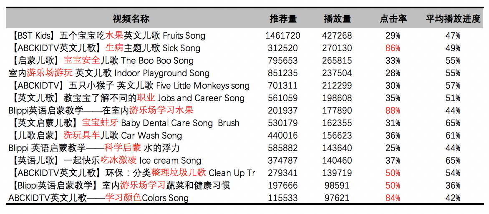
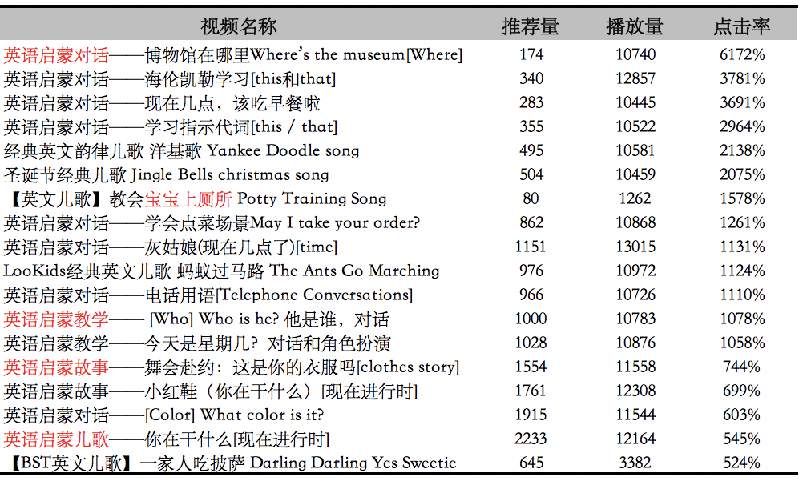

```{r setup, include=FALSE}
options(htmltools.dir.version = FALSE)
options(servr.daemon = TRUE)
```

# 目录

<br>

- 51Talk是做什么的 ？


- 我们做了哪些教学产品，踩了什么坑 ？


- 如何培养自己成为敏捷数据科学家 ？

???

算法专家、主要负责老师推荐、和算法教学产品的落地，今天给大家分享的这个题目是敏捷数据科学家如何玩转教学产品闭环，那么现场调研一下，大家做过相关数据产品的举个手？那么其他的我认为应该都是做的跟数据相关的工作哈~~ 不过没关系，今天我们这个topic的适配性很好，适合不懂数据的产品，也适合不懂产品的数据。那么要开开启这个话题，首先大家可以先了解一下我们做过的教学产品背后的公司是什么性质的。

---
class: inverse, middle, center

# 51Talk是做什么的？

---
class: middle, center
background-image: url(pic/51talk.png)
background-size: 200px
background-position: 90% 5%


<blockquote><b style="color:orange">青少</b>、成人、班课三条业务线</blockquote>

<blockquote>在线<b style="color:orange">一对一真人外教</b>英语学习平台</blockquote>

<blockquote>2016/06, 51Talk登录美国<b style="color:orange">纽交所</b></blockquote>

<blockquote>教师超过<b style="color:orange">20000</b>名外教，录取率仅为<b style="color:orange">3%</b></blockquote>

<blockquote>基于孩子语言发展规律自主研发的<b style="color:orange">经典英语青少体系</b></blockquote>

<blockquote>自主研发<b style="color:orange">AirClass</b>学习平台，适配多端，每天超<b style="color:orange">80000</b>节课程</blockquote>

---
### 学员分布最西到喀什，最南到西沙群岛，最北到漠河, 最东 Undefined....


---
### 管中窥豹: 上课过程

.center[
<video width="700" height="500" controls="controls" autoplay="autoplay">
  <source src="pic/1853.mp4" type="video/mp4" />
  </object>
</video>
]

???

而我们一对一的上课过程是怎么样的呢？通过Airclass平台，在我们自主研发的教材体系中进行互动式沉浸式教学，而我们的学习效果是怎么样的呢？

---
### 可以量化的学习效果和科学的课程体系

<br>


???

我们应该是国内唯一一家在线英语教育公司，有能力把教学效果外化的公司，我们可以看到从level0到level6，学员在课堂中的英语输出是逐步提升的。

---
class: inverse, middle, center
background-image: url(https://upload.wikimedia.org/wikipedia/commons/3/39/Naruto_Shiki_Fujin.svg)
background-size: contain

## 我们做了哪些教学闭环产品

???

公司那么多可做的点，为啥我们做算法的就选择了做教学产品呢？产品vp现在常给我们说：你们团队总是明知不可为而为之! 

---

# 基于ToB and ToC 的教学产品

- [约课攻略](http://junior.51talk.com/Mobile/Activity/appointStrategy/?uid=22883392230#/)

- **魔镜系统**

  - 个性化单词本
  
  - 个性化学习计划

???

我们之前也走过的弯路，关注数据赋能营销,但这些看起来能看到钱的技巧却不是教育的本质，教育不是付费转化率，是教书和育人。而教书也不是知识的传递，而是如何帮助学生构建这个知识体系，最后掌握对应的知识和技能，而同时我们也需要关注如何教育人成为人的这个话题。如果我们没办法做到这两点就没法提升续班率，转介绍率，和付费转化

因此我们选择了做教学产品，在整个体系中我们有对ToC的约课攻略、个性化单词本、个性化学习计划，有ToB的魔镜系统。那我们先来看看约课攻略的前身

---
## 学员约课业务流程

.center[</img>]

???

在51talk中，学员上课之前会必须要提前约课，学员约课可以通过pc或app进行约课，主要有优选老师、收藏老师，选择完老师后选择对应的时间点，然后再选择教材即可完成预约一节课程。在这里面，大概有70%+的都是从喜欢的收藏老师约课，这个指标代表着我们的用户对上课仍然希望是自己喜欢的，熟悉的老师来获得更好的上课体验。
特别是对于青少来说，对陌生的老师需要有很长的适应过程，因此如何能保证用户在约课的时候都能尽量约到自己收藏的老师，是我们需要尽力去优化的指标，

但实际情况是怎么样的呢

---
## 用户约课现状

<br>


???

用户经常吐槽要选择到自己喜欢的老师太难了，经常半夜抢课，且还选不到合适的老师。那这样的积累的情况下，必然就会导致能选到收藏老师的概率逐渐降低，约课更难，而从数据上，我们也可以做佐证这一点，尽量多的选择到自己的收藏老师，使得后期老师评价率更为正向，且对学员的课耗和上课效果都有着正向促进作用。

因此我们如若想提升学员体验，必须先解决约课难的问题，而只有约课问题解决了才可能解决效果问题
---

## 约课攻略

约课习惯、学习诊断、AI智能分析、分享助转介绍



???

比如这个学员约课不好的，但是学习效果不错的，我们会告诉他为何自己约不上好老师，自己差在什么地方怎么改进，而学习效果不错的，我们可以直接促进转介绍的分享。

---

## [约课攻略case](http://junior.51talk.com/Mobile/Activity/appointStrategy/?uid=22883392230#/)

学习回顾、最喜欢的老师、AI智能分析、个性化学习计划闭环


???

而有的学员约课体验较好，但是学习效果不够好的，我们就会告诉他在约课的现状，以及跟最喜欢的老师建立连接，怎么去预约到最喜欢的老师，而学习效果不好我们也会给出对应的个性化学习内容


---
class: inverse, middle, center
background-image: url(https://upload.wikimedia.org/wikipedia/commons/3/39/Naruto_Shiki_Fujin.svg)
background-size: contain

## **数据推断**符合sense

## **文案逻辑**毫无破绽

## 前后端**模板个性化**

## **约课/效果**双管齐下

## **学习闭环**无缝衔接

???

那么这样的一个约课攻略，我们既考虑到了不同的学员类型给与不同的个性化方案，有验证到了所有的产品可能的预期结果，可谓是


但是，这么一个闭环的数据产品推广起来如何呢


- 大数据：为啥要做个性化的约课攻略？大数据发起？

- 产品：我要来写这个PRD？不存在的

- 前端开发：我们做不了这种个性化模板

- 运营： 这文案我们也不知道咋弄啊

[**大数据负责产品PRD、后端个性化文案、前端demo、产品推广和培训**]

.center[]


---

### 约课攻略的落地效果

<br>

.pull-left-item[
**期待值拉满**：

- CRM、APP等多端推动上线

- CEO等在各种大会PR

- 服务营销端在双11专项推送

- 内部各个部门培训多场宣讲

]

.img-right[]
--

.pull-left-new[**但攻略产品属性最终决定了它较短的使用生命周期**]


--


???

那么我们约课产品上线后也是期待值拉满：


但这需要营销人员发送和解读给学员的约课攻略，每个学员大概也就看了1-2次，为啥呢？

攻略类产品的属性也就决定了它较短的生命周期，因此我们设计的姿势很完美，但还是不幸落水


---
class: inverse, middle, center

### 那么这样一个闭环的教学产品如此下场

### 是不是还有哪里不对？

---

## 魔镜系统背景

.pull-left-item[

- 约课攻略：用户和服务人员不存在.orange[信息剪刀差]

- 给到用户学习计划仍然无法持续产生反馈数据

- 服务人员服务非标准化、即使每月跟进也是.orange[尬聊]

- 所谓的最强抓手.orange[单元复习课]也是劳动力拉满(666h)

- 没有.orange[学习效果跟踪]，你可能上了一个假的在线教育

]

.img-right[]

???

为了单元复习课，单元回访，200多名用户，每个用户的8节课课程回放,每节课25min，差不多就是666h

学员看了这个倒是666了，但是你也得花费666h来处理


我们通过数据的整合，场景和教学的设计，以及对教学本质的深刻思考，设计了一个基于大数据的营销服务平台- 魔镜系统，而魔镜系统的诞生最主要还是因为约课攻略推动艰难，用户覆盖度上不去，当家长和课程顾问没有信息剪刀差时，服务就很难做，因为没办法体现出你的权威专业，很难建立这一层信任

---

### 魔镜系统启动：万事开头难

- 各端**认知**完全不在一条线

- 业务**数据**基本没有被设计，想要的核心数据没有，有的也是非标准化的

- 大数据推动的产品：(不配有)前端、产品、ui设计**资源**

- **人们不知道他们想要什么，直到你把产品放到她面前**

<br>

--
.center[]

???

魔镜最开始开发的背后，我们面临着这样一些尴尬的境地，没有产品没有前端没有设计，我们最富有的就是只有一些不健全的的数据，我们能做什么东西吗？没有资源我们可以创建资源、没有环境就自己上，没有营销服务人员的支持，我们就按照学员生命周期的流程逻辑来构建，而这就是当你没把产品推到服务人员面前的时，他也不知道这东西是如何的awesome！不知道自己可以这样的服务学员

---

## 魔镜大脑一分知用户

<br>



???

比如我们整个体系覆盖了学员的魔镜大脑页面、以画像的形式给到课程顾问最直接的展现，通过一分钟，我们就能知道学员的基本信息、学习效果和学习习惯和约课体验。

---

## 魔镜学习效果课课跟踪

<br>


???

再比如我们关注学员的学习效果，而学员的学习效果是否提升，学员的成长曲线如何，在什么时间点提升，哪些课程没有上好，

---

## 魔镜问题课程清晰可见

<br>

.center[]

???

没有上好的课程是外部设备、网络影响还是主要自己水平能力问题，这些我们都可以在魔镜找到答案。

---

## 魔镜学习闭环有数可依

<br>

.center[]

???

而学习效果好不好跟整个学习闭环做的好不好都有较大的关联，比如我们的学员的预习、复习、课程回放、学员的学习习惯（考勤）都有较大的关系

---
## 魔镜辅助资源助力效果

<br>

.center[]

???

那么针对学员学习效果不好的，我们不仅仅是诊断即可，我们也需要对症下药，这样才能真正改变结果，使得学员的学习效果得到提升，因此我们整合了单词本、个性化学习计划、以及正在筹备的一些教学产品，都会在这个版块来直接助力学习效果

---

## 魔镜辅助资源助力效果-[个性化单词本](http://enlighten.51talk.com/resource/wordunit_v2?uid=239626986&unit_type=last)

<br>


???

我们在提供个性化学习计划，主要是教学内容相关的动画、儿歌、绘本、亲子活动相关，这些都属于启蒙类的语音和场景输入，跟知识点直接关联性不够强，因此在我们的教学体系中，为了找到给到学员对知识点的掌握情况，并且查漏补缺，直接提升学员的学员效果

而这些项目都是单点突破，开发出来后，没有具体的载体帮助推广，最后就可能死于襁褓中。而约课攻略的推广也不是在app体系，而是在CRM体系，需要sales发送给用户，这就是教育跟其他互联网行业不太一样的地方，家长信任人多于产品体系，且都需要课程顾问的解释，因此他们建立了一个强纽带关系


## [个性化学习计划](http://enlighten.51talk.com/peasonalized_target?uid=39946600&level=0&unit=6&name=Baby&sig=229420bb3cf3f3d05ce8b33a95bac8a162d0d345)


.center[]


???

而个性化学习项目，比约课攻略项目开启的更早。主要是结合学员当前所学的单元以及知识点，匹配对应的学习内容，为何有这样的想法呢？
因为在市场调研中，家长比较在意孩子的知识点掌握情况以及如何给孩子制定学习计划，而目前的英语学习启蒙产品或者在线教育中，基本都没有这个环。因此我们也开辟了在线英语赛道第一个给学员个性化学习计划的公司，而学员的反馈都较好

---
class: inverse, middle, center

## 魔镜落地效果

### 每日请求超**10000**

### 上线以来服务超过**20W**学员

### 每日**100%**的服务营销人员使用 VS (68% CRM)


???

那么这样的一套系统，出来后结果如何呢？我们逐步覆盖了100%的SS的工作，累计服务了20W学员，每日请求超过1W，而这样的一套系统正是因为他的数据的准确性，服务工作的高效性和续班转化的有效性成为在线教育行业的魔镜。但这些数据的背后是什么呢？

---

### 魔镜背后的坑

- **设计**：我们设计了一个基于大数据智能的学员学情管理平台（**是改变还是幸福的改变？**）

- **试跑**：营销服务人员不要给我们增加负担，我们每天的工作就很累了

- **上线**：这么复杂的系统服务人员根本不会用的，你要简单到他们只需要托拉拽即可

- **理想场景**：我们希望营销服务人员能通过这些智能数据生成个性化的话术

- **实际场景**：以最快的速度把魔镜大脑截图发给学员家长、得到有效反馈后、主动写使用心得和手册、迅速在组内和组外推广

<br>

--

.orange[有点抵触-->别人试我也试试-->别人魔镜关单了我要学起来-->逐渐熟练-->写使用心得-->推广]

???

而当我们一步一步从开始的设计到产品demo试跑，就遇到了比较大的障碍，当时正在推广一个服务营销的工作台，他们称这个完全是基于课程顾问的工作SOP来做的，也得到了大多数人的认可，因此服务营销的负责人断定，基于他们的水平，像我们这种那么复杂的数据系统，SS是很难看懂的。且在试跑中也会增加他们负担，了解新东西的成本，以及建立信任比较难的，因此我们必须要是一个幸福的改变而不只是改变。

但从试跑到上线，他们仍然以最快的速度去体验，去发截图给家长，写组内的使用心得退关。


马云建立了无人超市，记者问大妈的看法：

大妈： 超市都没人了，还不得关闭
记者：不是没有人，而是没有售货员和收营员
大妈：那应该叫无员工超市，那么超市都不雇佣员工了，是不是更便宜了？
记者：这个并不了解
大妈: 老百姓只关心超市离得进不进，有没有假货，是不是便宜，你超市有无员工跟我有啥关系
记者：你是不是对马云有啥误解
大妈：马云的确从某些程度改变了我们的生活，但是我们要的不是改变，而是幸福的改变


---
class: inverse, middle, center
background-image: url(https://upload.wikimedia.org/wikipedia/commons/3/39/Naruto_Shiki_Fujin.svg)
background-size: contain

## 踩坑无数，生命不息，前行无阻

???

刚才所有看到的产品都是1-2个人完成，你可能会认为这是创业公司的做派，大公司一个螺丝一个钉，没办法施展拳脚，但是当你的认知远超其他团队时候，你的手和脑也会有自己的想法，因此下一part我们会讲到在现有的一些公司现状以及如何培养自己能够完成从数据到产品的成功落地，而这其中是怎样的一个过程。

---
class: inverse, middle, center
background-image: url(https://upload.wikimedia.org/wikipedia/commons/3/39/Naruto_Shiki_Fujin.svg)
background-size: contain

## 敏捷数据科学家是啥，应如何培养？

### 做数据里面有**数据架构**思维的

### 做数据架构里面有**产品思维**的

### 做产品里面最懂**前后端**开发的

### 懂前后端开发里面最**运营**的

---

### 如何培养自己成为敏捷数据科学家


- 主动出击的 **数据思维**

- 价值升维的 **产品思维**

- 从0到1的 **全栈** 技能

- 把豆子盘活的 **运营能力**（影响力）


---
class: inverse, middle, center

## 主动出击的数据思维

### 行研报告先知道

### 公司业务挖核心

### 无中生有得数据

???

大家经常会接到各种业务方的需求，因此被迫的做着一些自己并不感兴趣也没有激情的活儿，但这时候有没有问自己，你是否比业务方更懂这块的数据。这个业务应该看什么数据，我们现在应该做这个需求吗？她关注的是不是公司关注的指标等等

---
### 主动出击的数据思维 **行研报告先知道**

<br>

- 行研报告：Questmobile、36kr、Trustdata、教育行业报、AIMSEN行研等

- 公司内部调研数据

- 公司核心业务数据现状

---
### 主动出击的数据思维 **公司业务挖核心**

<br>

1. 找到核心业务的KOL

2. 取经成功的秘密武器

3. 秘密武器是否能自动化


???

而在公司里面，我们怎么才能挖到业务核心是什么？根据之前的经验，主要由以下三部：先找到核心业务的KOL，比如我们魔镜找到的是服务营销的Top，他们是最接近的用户的人，同时也知道什么样的东西是用户最关注的，找到他们续班转化的一些秘诀，看我们是否能做成自动化，让更多成功的服务动作可以标准化。

而在我们公司里，我们之前发现了一些核心的点：比如

---
### 主动出击的数据思维 **公司业务挖核心**

<br>

  1. 低年级运营：低年级口语作业**role-play或activity**，理解能力的迁移和反馈，提交作业到微信

  2. 高年级运营：更在意笔头内容，偏应试，**每日一练**反响很好
  
  3. 制定月度的**学习计划**是关键
  
  4. 每日群运营打卡教学相关内容
  
  5. 单元复习课是续班率的有力抓手
  
???

现在知道了公司的业务核心后，你需要知道你是否有数据可以去知道当前这些业务的现状是可采集的还是不可采集的，巧妇难为无米之炊，但是做数据科学家没有数据也一样要上岗的，那么没有数据应该怎么办呢：

---
### 主动出击的数据思维 **无中生有得数据**

<br>

1. 没有数据：.orange[内部自流通采集]

2. 没有数据：.orange[调研或自己产生？]

3. 没有数据: .orange[爬虫(在法律边缘试探)]

???

没有任何公司数据可以首先查看公司的内部数据流，如果没有的情况可以通过调研或者其他第三方自己产生相应的数据，或者再不济也可以游走在法律的边缘爬取别人的数据

---
### 主动出击的数据思维 **无中生有得数据**

搞清楚内部业务数据流助力数据采集

.center[]

???

从公司内部中，我们之前做魔镜的时候就发现，要想评估学员的学习效果，知识点的掌握必不可少，在这种情况下生成了一套教研的内容和知识点管理系统，通过跟内容产生的平台打通，产生这些宝贵的知识埋点数据。那有的数据是当前业务体系下没有的怎么办呢？

---
### 主动出击的数据思维 **无中生有得数据**

#### 没有外部数据如何弥补认知遗漏

<br>

.center[]

???

比如我们想知道什么样的教学内容是用户喜欢的，更容易被用户学习的，那么我之前就创建了一个爱奇艺自媒体号，运营国内外的英语启蒙的资源，我需要看到在这个爱奇艺的用户量及体系下，什么才是用户最喜欢的

---
### 主动出击的数据思维 **无中生有得数据**

#### 外部数据找insight：生活场景沉浸式体验有助学习体系构建

.center[]

???

我们找到了的答案：也就是游乐场、玩具、洗澡、安全等这样的一些生活场景 可以帮助孩子更好的学习，同时也会发现一些新起之秀，比如我们的垃圾分类、科学启蒙等

---
### 主动出击的数据思维 **无中生有得数据**

#### 外部数据找本质

.center[]

???

那么什么样的内容才是用户自己觉得好的呢，刚才那些可以说是平台推荐后用户点击，而这样的一些东西，使用户反复看，而无需推荐的。

就是我们的英语启蒙场景的对话，而这样的对话形式完全来源于孩子的生活学习场景

---
class: inverse, middle, center

# 价值升维的产品思维

### 产品切入点

### 用户洞察

???

当我们有了数据思维后，我们需要懂点产品，才能更好的去推进我们的奇思妙想落地

---
### 价值升维的产品思维  **产品切入**

<br>

- 从本质思考(怎么学、怎么教、怎么测)

- 从重点思考(怎么学、怎么测)

- 从上层思考(内容、教师、反馈(数据)、技术)

???
那么怎么去切入到产品中呢？
比如教育中，我们关注怎么学，怎么测；这也是数据上能去关注的，但是怎么教这是教研体系去设计的

---

### 价值升维的产品思维  **如何从本质思考** 

<br>

- **教学内容好**（教研编排体系、配套内容体系、level等级等）--》让孩子感兴趣，学得会

- **学习效果好**（效果外化）--》让孩子学得好、有成长

- **运营服务好**（解决学员学习和费学习中的诸多问题）--》让家长没有认知负担

- **性价比高**（价格低、老师棒、优惠政策等）--》让家长付出更低成本

- **学习规划好**（有目的，有资源，有路线，有方法）--》让家长无近忧和远虑

- **教育理念好**（有门槛但又不失温度）--》让家长有参与，有成长

--

<br>

**老师教得好，学生学的爽，家长有成长**

---
## 价值升维的产品思维  **用户洞察**

<br>

- 从数据知用户（参考行研报告）

- 从本质知用户（用户心理学）

- 从工具知用户（墨刀、processon、Axure...)

---
class: inverse

### 价值升维的产品思维  **用户洞察：从数据知用户**

- 学员水平：接近**80%+**都是零基础

- 目标：早期培养孩子的**兴趣**，后期达到**流利交流**的水平

- 家长水平：近**七成**的51talk家长达到本科及以上学历(二三线更低)；

  - 辅导：英文水平越低越关注孩子**知识掌握情况**；

  - 辅导：近**五成**家长关注如何给孩子制定**系统的学习计划**；

  - 教育知识：家长学历越高越关注正确教育孩子的态度和方法；同时也非常关注沟通互动的技巧

.footnote[[*]来自51Talk 2017第二季度用户调研]

???

不会说英语的家长对此问题关注度达到63%，马斯洛需求金字塔，经济基础决定上层建筑，这部分经济水平和自己的水平越低的人更在乎性价比，关注产出，而更高级的人在乎经济建设，非认知类建设

流量下沉的时候，我们应该先产品下沉，保证家长有时间的情况实践成本降低

---
### 价值升维的产品思维  **用户洞察： 从数据知用户** <sup>*</sup>

低年级主要为**注意力不集中**和**自主学习困难**，而越往高年级是**偏科**和成绩**不稳定**

.center[]

.footnote[[*] 2016-2017教培行业调研]

???

初中开始后，注意力越来越不集中，偏科也越来越少。
---

### 价值升维的产品思维  **用户洞察：从本质知用户**

.pull-left-item[

- 儿童心理学

- 发展心理学

- 认知心理学

- 教育心理学

- 蜥蜴法则

- 让孩子主动学习的60招

- 追求理解的教学设计

- 用户思维：好产品让用户为自己尖叫]

.img-right[]


---
class: inverse, middle, center

# 从0到1的全栈技能

---
## 从0到1的全栈技能

<br>

- 从开发到上线(特征工程能力、模型能力、AB test流量分配、自动化部署上线ansible/ansible-playbook/python uwsgi/Nginx)

- 后端接口(python: Django/Flask  R: Rest API (plumber/opencpu))

- 前端技术基础(**Vue.js** /Angular.js/HTML/CSS/Vuex.js、埋点)

- 前端技术框架(**VueElementAdmin**、vuetify-material、Vue-beauty、Anti design)

???

当我们了解了这样的一些前后端技术，我们把产品做出来后，也需要去推广，不然产品也可以烂尾，没有人能懂得他的好

因此我们有需要把豆子盘活的运营能力

---
class: inverse, middle, center

## 把豆子盘活的 **运营能力**

--

### 如何定义你的用户喜欢你的产品

--
### 如何盘活你的产品


???

同志们：别炒股，风险太大了，还是做豆腐最安全！做硬了是豆腐干，做稀了是豆腐脑，做薄了是豆腐皮，做没了是豆浆，放臭了是臭豆腐！稳赚不亏呀！   ----冯巩

---

### 把豆子盘活的 **运营能力**

<br>

.pull-left-item[

#### 如何**定义**你的用户喜欢你的产品

- 有多少人在使用

- 每天使用产品的频次

- 哪些功能用户经常在使用

- 这些人使用产品都为哪些人服务

- 服务的这些人是否达到了预期设计

]

.img-right[</img>]

---
### 把豆子盘活的 **运营能力**

#### 如何盘活你的产品: **调动参与感**

找到KOL组试跑MVP，每天及时反馈和参与迭代设计，并及时撰写相应的服务使用手册

<br>
.center[]

---
### 把豆子盘活的 **运营能力**

#### 如何盘活你的产品: **假设自己是一个用户**

<br>

.center[]

???

产品一开始出来，可能大家都不知道；应该如何使用这个产品，因此产品结合服务工作的SOP必不可少

---
class: inverse, middle, center
background-image: url(https://upload.wikimedia.org/wikipedia/commons/3/39/Naruto_Shiki_Fujin.svg)
background-size: contain

## 成为敏捷数据科学家的路线是？

--

### 做数据里面有**数据架构**思维的

--

### 做数据架构里面有**产品思维**的

--

### 做产品里面最懂**前后端**开发的

--

### 做全找开发里最懂**用户运营**的


---
class: center, middle,inverse

# Any Question

## **renwanfeng@51talk.com**

