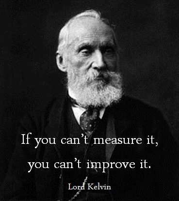
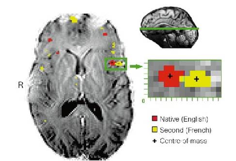

```{r setup, include=FALSE}
options(htmltools.dir.version = FALSE)
options(servr.daemon = TRUE)
```

# 主要内容

- 少儿规划之**现状**

  - 用户端

  - 机构端

  - 教研端

--

- 少儿规划之[**架构**](http://10.0.1.78:8123/admin/)

  - CMS系统-教学目标

  - CMS系统-维表设计

  - CMS系统-内容设计(音视频书籍文章单词等)

--

- 少儿规划之**应用**

  - [少儿规划**demo**](http://enlighten.51talk.com/cej_target/0/6/Eric)

  - [如何录入内容](http://10.0.1.78:8123/admin/)

---

class: inverse, middle, center

# 以用户为中心

---
class: inverse, middle, center background-image: url(<https://upload.wikimedia.org/wikipedia/commons/3/39/Naruto_Shiki_Fujin.svg>) background-size: contain

## 极致的用户体验=老师+**内容**+**服务**+**技术**(测评/推荐/反馈）
---

# 用户

- 心中有目标

--

- **脑中有理论**

--

- 手中有资源

--

- **脚下有路线**

???

实际上我们很多用户都是没有目标，或者存在一些伪目标，或者自己目标都不清晰这是用户的理想状态，那实际情况是什么呢？

比如我想要让孩子《英语达到第二语言的水平》

---

class: inverse

## 用户的现状<sup>*</sup>

- 学员水平：接近**80%+**都是零基础

- 目标：早期培养孩子的**兴趣**，后期达到**流利交流**的水平

- 家长水平：近**七成**的51talk家长达到本科及以上学历(二三线更低)；

  - 辅导：英文水平越低越关注孩子**知识掌握情况**；

  - 辅导：近**五成**家长关注如何给孩子制定**系统的学习计划**；

  - 教育知识：家长学历越高越关注正确教育孩子的态度和方法；同时也非常关注沟通互动的技巧

.footnote[[*]来自51Talk 2017第二季度用户调研]

???

不会说英语的家长对此问题关注度达到63%，马斯洛需求金字塔，经济基础决定上层建筑，这部分经济水平和自己的水平越低的人更在乎性价比，关注产出，而更高级的人在乎经济建设，非认知类建设

## 流量下沉的时候，我们应该先产品下沉，保证家长有时间的情况实践成本降低

---

class: inverse

## 用户的现状

- 家长意愿：**72%+**的家长认为家长也需要学习孩子的课程

- 家长时间：接近**90%+**的家长都是有时间陪伴孩子学习的

.center[]

???

除了在英语学习上，用户主要关注哪些问题
---

## 家长主要关注孩子的方面<sup>*</sup>

.center[]

.footnote[[*] 2016-2017教培行业调研]

???

## 而在学习这块，学员主要存在哪些问题呢？

---

## 付费学员存在的问题分布<sup>*</sup>

.center[]

.footnote[[*] 2016-2017教培行业调研]

---

## 付费学员不同年龄的问题分布<sup>*</sup>

低年级主要表现为**注意力不集中**和**自主学习困难**，而越往高年级是**偏科**和成绩**不稳定**

.center[]

.footnote[[*] 2016-2017教培行业调研]

???

初中开始后，注意力越来越不集中，偏科也越来越少。

---

## 付费学员存在的问题解决分布

所有人都偏向于通过**课外培训**解决问题，其次是自主辅导，再然后是求助学校老师

<br>

.center[]

???

母亲相比父亲更爱求助学校老师，而不爱自己辅导孩子，同时母亲多半认为学习困难不重要。

老一辈人也更偏向于自己辅导孩子，而不求助学校老师，主要还是时间问题。

那么对于家长和学员的这个需求现状，零基础的用户究竟应该怎么学，英语分为道和术，那么想要正确的方法必须要坚持正确的道作为参考

---

class: inverse, middle, center

# 教育机构

???

那么教育机构应该关注什么呢？要做极致的用户体验，就必须能找到能够让用户留在51talk学习的核心价值点，那么这个核心价值点是什么？是我们有一群跟他们年龄相仿的伙伴？还是有他们喜欢的老师？还是优质的教学内容？

---

# 教育机构

- 内容构建系统：如何搭建一套系统可以服务家长和学员的教学内容

--

- 内容产生机制：内部**自研**和外部**授权**(绘本、视频、动画、文章、妈妈说？)

--

- **内容消费**: 阅读？学习计划？课程输出？

--

- ~~**内容评估体系**~~

???

理想的教育机构应该做到什么样？

内容消费：宝宝玩、多纳学英语、叽里呱啦

---

class: inverse

## 机构的现状？

- **资源提供方**：叽里呱啦、宝宝玩英语，没有有效组织(最多按照年龄)

- **资源生成和消费**：毛妈Carol/绘本圈，相对有效的组织，但没有体系化，仍然根据经验

- **少儿启蒙产品**：自由星球、DaDaBaby、粉笔0-6启蒙星球等

--

- ~~**水平测试**:更多的还停留在知识点阶段~~

--

- ~~**非认知能力测评**~~：慕华尚测EDMA等

--
- ~~**启蒙路线个性化**~~

???

原地转圈。无个性化，如何到兴趣转变？

下面对于教研人员，非常重要，内容只是一个载体，老师才是传道受业的核心。何时教，怎么教，如何教都一样重要，
源于我们的教研可能没有按照基于理解的教学设计去设计，没有反馈。

---
class: inverse, middle, center

# 教研人员/家长



---
class: inverse

# 如何教？**道术合一！**

--

## 追求理解的教学设计

- 确定预期目标

- **找到评估证据**

- 设计学习体验

--

## 语言理论

---
layout: true
class: inverse

# 追求理解的教学设计

???

首先我们来看看术，也是大家最熟悉的，大家经常做教案，但是我们认为，针对家长的需求，要想看到有效果的，能有知识掌握程度的可度量的教育应该是这样设计的

---

## 确定预期目标

**从问题到理解，从理解到迁移**

- 问题：主题的问题是什么？【**如何问问题**】

- 知识：学习到相应的知识，预期的理解是什么

- 技能：能够使用相应的知识完成某个任务

- 评估：对自己和他人的任务进行评价

???

比如营养话题：吃什么最容易长痘痘？ 身体奥秘：为何我们有五个手指？不是4个3个 阅读：为什么美国那么重视阅读，仍然有那么多阅读障碍者？ 圆形：井盖什么是圆形的？

---

## 找到评估证据

- 知识：课堂小测验、课后题

- **技能测试**

- **迁移**：表现性任务

- **自我评估**和反馈

---

## 设计学习体验：WHERETO

- W= 帮助学生知道此单元的**方向(Where)**和预期 **结果(What)** ,帮助教师知道学生从哪里(Where) 开始(先前的知识和兴趣)

- H= **把握(Hook)** 学生情况和 **保持(Hold)** 学生兴趣

- E= **武装(Equip)** 学生，帮助他们 **体验(Experience)** 主要观点和 **探索(Explore)**问题

- R= 提供机会去 **反思(Rethink)** 和 **修改(Revise)** 他们的理解和学习表现

- E= 允许学生 **评价(Evaluate)** 他们的学习表现及其含义

- T= 对于学生不同的需要、兴趣和能力是否能做到 **个性化(Tailor)**

- O= **组织(Organize)** 教学使其最大化程度的提升学生的学习动机和持续参与的热情，提升学习效果

???

对于教研人员或者家长来说，我们不仅仅要知道怎么教，还需要知道何时教;

---
layout: false 
class: inverse, middle, center

# **语言理论支撑**

--

## 双语理论

--

## 关键期理论

--

## 习得方法理论研究

---

class: inverse, middle, center

# 双语理论

---

# 双语理论

- **双语学习使得孩子具有更开放和批判性的思维**：社会学研究表明，一个人对其他文化的开放与接受的态度，与自己所学的语言和语言相关的互动有关，比如**黑天鹅理论**；

--

- **机会**：比如出国留学、外企工作等，以便未来生活工作所需；诸多中高层都会对英语能力有所要求

--

- **双语儿童能够更早的开发大脑元认知模式**：双语儿童相对于仅母语者，能够更早的利用语义记忆（Ellen Bialystok 2001)

???

实物独特的特征，比如想到鹦鹉时，是学舌，想到猫咪时候，是"喵喵"的叫声，而这些都是独特区分于其他动物的，因此大脑更早的开发语言和记忆的元认知能力

---

class: inverse, middle, center

# 关键期

---

class: inverse

# 关键期理论

- **关键期**来源 (奥地利生态学家康罗德·洛伦兹 1937)

- **八大智能体**发展的关键期

- 语言各项能力关键期

.center[]

???

发现刚孵出的幼鸟，如小鸡、小鹅等，会在出生后很短的一段时间内学会追逐自己的同类或非同类;心理学家将这类研究借用到儿童早期发展的研究中，提出了儿童心理发展的关键期问题。如2～3岁是儿童口头语言发展的关键期，4～5岁是儿童学习书面语言的关键期等

依恋期：妈妈的作用不可替代，在帮助孩子理解层次上，刻印心里

---

class: inverse

## 八大智能体系存在不同的关键期<sup>*</sup>

.footnote[[*] 美国发展心理学教授霍华德•加德纳(Frame of mind,1983)]

.pull-left-item[

- 语言智能: **0-10岁**

- 数学逻辑智能: **1-4岁**

- 身体运动智能: **0-6岁**

- 人际情绪智能: **2m-2.5岁**

- 视觉空间智能: **0-2岁**

- 音乐艺术智能: **3-10岁**

- 规则意识: **2.5-3.5岁** ]

.img-right[ ]

???

认为人类的智能是多元的，但几乎每个人都是聪明的，只是聪明的定义不一样，每个人的智能图谱都不一致，这个智能的形成和发展也不完全是天生的，也依赖后天的环境和教育音素，需要经过学习实践来提升。而孩子发展了什么样的智能对于未来能承担什么类型的工作也息息相关

---

class: center,middle

### 语言关键期


---

# 语言关键期

- **语音**：语音敏感期其实发生在从出生到**10个月**，此时的大脑最容易获得所处语言环境的语音原型(Neville and Bruner，2001; Dr.kuhl)

--

- **语法**：儿童和成人的脑对二语学习的处理器完全不同，延迟接触语言会导致脑使用不同的策略来加工语法信息；越早接触第二语言可以形成高效的语法加工策略,且有着**显著的年龄效应**(Nevilleand Bruner，2001;Dekeyser 2010）

--

- **表征**：儿童早期学习体现的优势不仅仅是语法加工策略，还和语言知识如何表证密切相关，更早学习是可以调用高级处理的语义层(Dekeyser 2012)

--

- **词汇**：词汇习得可能更少受年龄效应的影响，成人的第二语言学习词汇在大脑中储存的位置或词汇通达的脑电成分和母语者一致，词汇量可以达到母语水平(Ullman；Dekeyser)

???

语言发展存在着敏感期（即发展机遇期），敏感期内语言功能回路最容易发生经验依赖性的变化（在练习中逐渐形成内化，可以实现随时随地的精确调用） 那么在语法这块

---

class: inverse,center,middle

## 从大脑语言激活模式来看

---

class: center

### **早期**双语者weirnicke区的激活**重叠**

### **晚期**双语者两种语言在Broca区的激活区域**分离**

.pull-left[ ]

.pull-right[ ]

???

## 重叠和分离最通俗的理解就是加工的快慢

---
class: inverse,center,middle

## 从语法来看

---

.center[### 第二语言启蒙年龄越大，语法学习成绩越差<sup>*</sup>]

.center[]

.footnote[[*] Dekeyser进行了两个平行对照研究，左边是俄罗斯人在美国学习英语，右边是俄罗斯人在以色列学希伯来语] 

---

class: inverse,center,middle

## 从口语熟练程度来看

---
class: center

### 3-7岁开始说英语的移民者口音跟母语者很像<sup>*</sup>


.footnote[[*]参考Jacqueling Johnson和Newport研究]

---

class: center

#### 7-12岁期间开始讲英文，熟练程度只有母语者**80%**, 而12-15岁的只有**50%**<sup>*</sup>


.footnote[[*]参考Jacqueling Johnson和Newport研究]

---

class: center

### 15岁以后移民说英文，熟练程度只有母语者**20%**<sup>*</sup>


.footnote[[*]参考Jacqueling Johnson和Newport研究]

---

class: inverse,center,middle

## 为什么是这样？

---

class: inverse,center

## 人类大脑在**进化**

--


模型优化：为了不断适应后期复杂性的增加需要进行神经突触的剪枝

---

class: inverse, middle, center 
background-image: url(<https://upload.wikimedia.org/wikipedia/commons/3/39/Naruto_Shiki_Fujin.svg>) 
background-size: contain

## 综合来看二语习得的关键期在**3-6岁**

---

class: inverse,center,middle

# 习得之**道**术

---

## 英语学习的道

Dr.Krashen提出的**二语学习理论**:

--

- **输入理论**：英文学习的根本在于input输入，缺乏输入就不可能学好任何一门外语(**在课堂就可以吗**)

--

- **可理解性I+1原则**：遵守I+1原则，i即你**现在的水平**，1稍微需要挑战的难度，那教学者应给予的阅读和听力难度即应是"i+1";

--

- **集中式输入**：输入的材料类型和难度级别在一定时间内相对要狭窄，狭窄输入自己感兴趣的材料，可以把熟悉的语言知识以不同的模式快速熟悉起来

--

- **心理情绪机制**：孩子学习的材料和环境应该是有趣的，过程越愉快无压力，输入越有效

--

- **自然顺序假说**：语言知识的成长都有一定的自然顺序

???

自然顺序中：为何是学现在时代-过去时(记忆）-将来时(计划)

而这部分的道不仅仅是家长需要知道的，对于教育机构来说也应该知道，道和术

---

class: inverse,center,middle

# 习得之道**术**

---

# 二语习得之术

- 每周**学习频率**：高低频学习效果差异30%+ (51Talk大数据分析)

- 资源组合方式：**立体化**

  - 互补性(听说读写):视、听觉理解活动过程中韦尼卡脑区被激活的位置各不相同（Glattke 1973)，**In two years, he has married 10 women.**

  - 重复性：重复性阅读和听音的方式能提高学生的阅读流畅度、准确度以及语篇理解率（Rasinski 1990; Dowhower 1987);重复促进肌肉记忆，输入次数的增多与理解率的提高呈现正比关系

  - 集中输入假说：类似情境下重复率越高学习越有效，比如家里吃饭、餐馆吃饭、旅游时候吃饭；

???

一：大脑会选择性记住跟生活价值相关的信息 二：其二是：有限的英文资源限制了我们的认知 很多看起来非常简单的短语（如take come get等词+介词组成）

---

# 二语习得之术

## **社交互动**的必要性

- 语言理解过程的双码理论（Paivio 1986;Clark & Paivio 1991)

- 互动 VS 音视频 VS 音频（2003）

  > 美国华盛顿大学Patricia Kuhl教授(脑科学与儿童语言学家)进行了相应的实验，9月大的婴儿学习中文一个月，三个对照组分别为：听音频、看视频和跟中国人直接对话，最后发现**只有对话的才会对中文语音更加敏感**，而其他的几乎无差别

- 真人在线互动 VS 虚拟互动录像（2014）

  > 1-2岁婴儿分两组，学习一个词汇，一组真人skype交流，一组播放提前录好的视频，均通过屏幕与人交流，录像缺乏及时调整反馈最终只有真人在线交流的学会了这个词汇

???

每周3次每次25min， 接受信息需要启动语言和非语言系统（比如表情、手势等非语言信息或者交际场景信息）

Kuhl的实验还支持了这样的观点，学习第二语言，希望达到母语水平，是经验期待性学习（Experience－expectant Learning）。实现这种学习需要两个基本条件：一个是神经系统的发育为这种学习提供了可能实现的机会；另一方面，能为幼儿提供合适的环境刺激，包括社会情绪的环境;有关语言学习的神经回路不是一个孤立的回路，而是涉及感知、认知、情感、动作等广泛的神经回路

---

class: center, bottom, inverse

# More confused

--

存放各种资源超过**200G**?

--

**复制粘贴内容** 到所有的微信群？

--

学生和家长反馈纯靠**EXCEL**记录？

--

家长学院每日一词绘本馆等教学的产品不知道学员反馈？

--

如何把现在已经制作好的视频放到一个系统里，以后方便调用？

--

.

--

.

--

.

???

background-image: url(pic/confused.jpeg) background-size: 100px

## background-position: 90% 8%
---
class: inverse, middle, center background-image: url(<https://upload.wikimedia.org/wikipedia/commons/3/39/Naruto_Shiki_Fujin.svg>) background-size: contain

## 极致的用户体验=老师+**内容**+**服务**+**技术**(测评/推荐/反馈）

---

# 用户需求 VS **猩球启蒙计划**

.pull-left[

1. 心中有目标(教学)；

2. 脑中有理论(启蒙)；

3. 手中有资源(学习)；

4. 脚下有路线(周计划)；

5. 嘴上有反馈(内容) ]

.pull-right[

1. 内容构建(CMS)；

2. 产生机制(教研/教学/家长UGC...)；

3. 内容消费(App/小程序/公众号...)；

4. 内容输出(课程)；

5. 内容反馈(周/Activity/测评)

## ]

---

# 数据化产品基础

- **用户**：信息系统，包含注册和基础数据采集(家长和学员)

- **内容**

  - **资源**：内容数据层，包含内部和外部的音频、视频、绘本、家长实践指南和启蒙理论文章（学习心得等）以及题库内容、

  - **理论**：内容架构层：主题螺旋系统的设计(Bloom分层教学法)、标签Tag体系设计、Grammer知识点体系设计、逆向教学设计法、二语习得

  - **路线**：内容消费层，单元主题/周计划和教学目标的制定（教研），根据单元主题自动可以匹配到已有的内容和

  - **测评**：消费题库内容，决定用户应该消费什么内容，基础的course/unit/level测试和相关测试（reading/Listening/Phonics)

- **反馈**：.orange[所有跟学员学习媒介相关反馈（CC、CST、家长、外教、作业等）]

???

## 讲一下我们的反馈体系的设计，five little monkeys

---

class: inverse,center,middle

# [我们的CEJ单元个性化学习计划](http://enlighten.51talk.com/cej_target/0/6/Eric)
# [我们的启蒙计划](http://enlighten.51talk.com/target/2)

---

class: inverse,center,middle

# [我们如何使用这个CMS系统](http://10.0.1.78:8123/admin/)

---

class: inverse,center,middle

# [我们如何设计反馈体系](http://123.56.15.24:4567/learnenglish/five_little_monkeys)

---

class: center, middle,inverse

# Any Question

## **renwanfeng@51talk.com**
