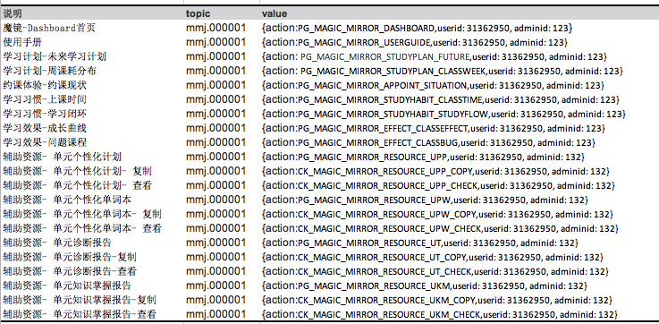

```{r setup, include=FALSE} 
options(htmltools.dir.version = FALSE)
options(servr.daemon = TRUE)
```


# 主要内容

1. 为什么需要埋点？

2. 埋点需要哪些基础知识？

  - HMTL + CSS + JavaScript
  
  - 前端框架如VUE(当然大概知道结构就行了)


3. 如何埋点？

  - 埋点1.0版本（鹏飞版）
  
  - 埋点1.1版（前端pind_data版)

---
class: center, middle, inverse

# 为什么要埋点？


???

巧妇难为无米之炊

---

# 数据从何而来？

<br>

- 外部数据：爬虫<sup>*</sup>、调查问卷（线下和线上）、黑客等

- 内部：后端日志

- 内部：前端埋点

.footnote[[*] [利用爬虫技术能做到哪些很酷很有趣很有用的事情?](https://www.zhihu.com/question/27621722)]

---
class: center, middle, inverse

# 埋点需要哪些基础知识？


---

# 网页基础知识

<br>

一个网页的源代码是包含 HTML, CSS 和 JavaScript 的纯文本。

   - HTML: 标记语言。只有语法，没有变量和逻辑，不能称之为~~编程语言~~。

   - CSS: 控制元素的展现形式

   - JavaScript: 操作HTML中元素的增删改

--

进一步可以懂一丁点VUE.js之类的框架...

---
class: center, middle, inverse

# 怎么埋点？

## 埋点1.0版本（原始）
## 埋点1.1版本（埋点和业务代码分离）

---

### [埋点1.0版本](http://123.56.15.24:4567/mercury2.0/web-deploy-detail)       VS       [埋点1.1版本](http://npm.51talk.com/package/@51npm/pind-data/v/1.1.1)

.pull-left[

1. 页面js中定义全局变量:**{"t":"rec.000001"}**

2. 在1的后面scipt中引入**pind.js**

3. 在js中定义监听事件，由**__sdonclick(value)**触发回传

4. 在相应的DOM节点中增加**click**监听事件

5. 打开浏览器点击触发相应区域测试]

.pull-right[

1. 全局引入或者index.html中body之前顶部引入**pind.js和pind_data**；

2. created中定义全局参数变量**{"t":"rec.000001"}**并回传(PG)

3. 在DOM节点中增加自定义属性**data-analytics**和对应的value

4. 打开浏览器点击触发相应区域测试；
]

---

# VUE埋点1.1版本 -- **引入**

- 在src/main.js中全局引用pind.js、pind_data.js

```js
import './pind.js'
import './pind_data.js'
```

- 或者在index.html引入pind_data.js和pind.js

```html
<html>
  <head>
     <title>51talk Adaptive Learning</title>
  </head>
<script src="//cdn.51talk.com/apollo/public/js/pind.js"></script>
<script src="//cdn.51talk.com/apollo/public/js/pind_data_1.1.0.js"></script>
<body>
</body>
</html>
```


---

# VUE埋点1.1版本 -- **调用**

- click事件触发(默认**事件无参数**)：

```html
<div data-analytics= '{"action":"access_PG_PRETEST_EXPLAINATION","unitid":"123"}' >点击测试</div>
```

- click事件触发(**事件带参数**)：

```html
<i class="word-sound" @click="sound(item.media_link)" :data-analytics='`{"action":"CK_UNIT_KNOWLEDGE_PHONIC_SOUND","type":"phonic","id":${item.id}}`'></i>
```

- js中手动调用`pindData.pind_send()`,适用于click带**多参数或click.stop.prevent**事件

```js
sound_custom: function(url,type,id){
        var audio= new Audio(url);
        audio.play() //autoplay自动播放 loop循环播放  pause暂停
        let action = "CK_UNIT_KNOWLEDGE_MASTERY_"+ type.toLocaleUpperCase( ) +'_SOUND'
        pindData.pind_send( {"action": action,"type": type,"id": id} );
      }
```

---

# VUE埋点1.1版本 -- **测试**

```js
<input type="button" value="{"t":"ukm.000001","v":{"action":"CK_UNIT_KNOWLEDGE_MASTERY_PHONIC_SOUND","type":"phonic","id":45}}" id="added_object_for_bi" style="display: none;">
```

<br>


---

# VUE埋点1.1版本 -- **测试报告实例**




???

# ~~统统不需要~~

### **只需要:**

# [CurlWget](https://chrome.google.com/webstore/detail/curlwget/jmocjfidanebdlinpbcdkcmgdifblncg) + [uncurl](https://github.com/spulec/uncurl)/[curl2r](https://github.com/badbye/curl2r)


---
class: center, middle,inverse

# Any Question

## **renwanfeng@51talk.com**

