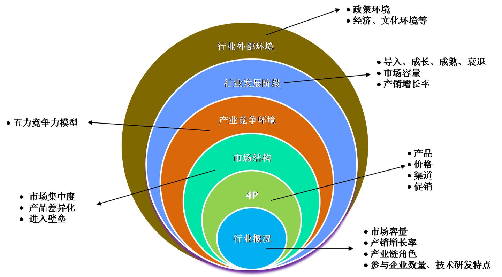
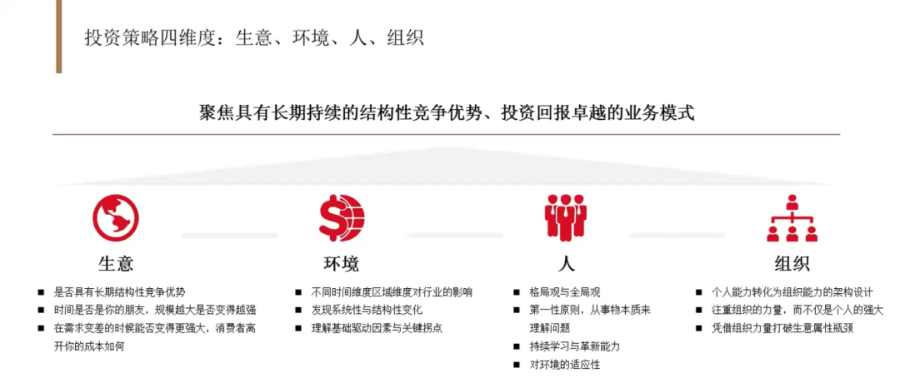

# 如何分析和选择一个行业

该分析框架融合了经济学、营销学、战略学等多个学科的，是一个六层立体式渐进分析图，从六个方面，由近及远，由微观至宏观，由表及里，层层推进展开，基本上涵盖了行业分析的主要指标。便于大多数人理解和掌握。

## 投资一家公司的逻辑

高瓴擅长投资生物医药，消费，TMT互联网，企业服务四大领域 ，这些行业天然具备高护城河，高ROE，高ROIC的特点。

?> 高瓴的投资策略有四个维度，分别就是生意、环境、人和组织。

### 生意

!> 选择商业模式优秀和ROIC高（投资回报率资本）的好生意，ROIC 低于 6%的公司，这些公司都是时间的敌人，都是伪成长。对于一些小企业，有些项目暂时是亏损的，但长远看能取得不错的ROIC。这考察投资者对公司未来的前瞻力，这是投资的难点之一
   
时间的朋友两个要点：

1.保持长期结构性竞争优势的公司和行业是时间的朋友，高 ROIC只是结果，而赛道和竞争格局、商业模式、护城河才是根本原因（这是生意的天然属性）；发现优质赛道和优秀竞争格局的公司是最难的，需要投资者对商业有非常深度的调研和认知。

从两个财务维度看什么是 长期结构性的优秀公司和行业？

用两个指标 ROIC 和g（增长率）做成四个象限:

- 高ROIC+高成长 : 投资里面的战斗机 ，例如：骨科赛道的爱康医疗（成长性 50%，ROIC 20%）， CRO赛道的药明康德 （成长性 20% ，ROIC 15% ） 眼科赛道的爱尔眼科 （成长性 30%，ROIC  15%），还有高瓴资本最近一级市场投资的国产奶粉赛道  君乐宝，和君乐宝一个赛道的龙头公司飞鹤也值得关注  都是这种特点的公司。

- 高ROIC+低成长：现金奶牛  例如：格力电器 ，海螺水泥

2.你选择的生意是否有规模优势，即随着公司规模的增长，成本是不是能真正降低（边际成本随着规模迅速降低，但并不是所有的生意模式都能够有所谓的规模经济效应，比如餐饮业（火锅赛道除外，如海底捞），中国餐饮业的标品化程度非常低，随着门店扩张到1000家，人员和运营成本、管理成本都会相应上升；同样的， 教育行业也存在相同的问题。
3.你投资的公司能不能在行业低谷的时候逆势扩张。（这一点很重要，在行业逆风期，竞争力差的公司会倒下，要找到这家公司相对同行的真正优势在什么地方。历史经验，往往在需求端整体变差的时候，行业龙头的日子相对比较好过，很多公司都是在宏观或者是在行业需求变差的时候，竞争对手会比他先死掉，他反倒能在过程里扩大市场份额。非常典型的例子是格力和美的两个家电巨头。基本上只要周期性或者是宏观因素导致需求端变差了之后，头部的两家家电企业反倒不断扩大市场份额。）
4.投资的科技企业，是价值利好还是价值毁灭（高端护肤品或者白酒通过电商领域提升品类集中度。国际知名的高端护肤品牌，资生堂、雅诗兰黛、海蓝之谜，都通过电商领域就一下子下沉到了非常低线的城市，这些得益于科技创新，但是对于其他的消费品，受到电商兴起极大的影响；但是还有一个非相关的替代品市场，外卖兴起后，康师傅方便面的销量就大幅降低）
   
### 环境

环境解决什么时候应该买入好生意的问题，提高投资回报率。

环境包括很多方面， 从宏观经济环境，到不同行业的政策环境、监管环境，甚至再到更底层的，人口结构变化的环境，都会对投资造成很大的影响。 环境基本上决定了对于一个公司投资的，到底什么才是对的时间点？也就是说，为什么要在当下这个时间点去布局这些行业，去投资一些公司。
有一个极简的价值投资公式：

?> 价值=（价格-成本）× 品牌市占率 *品类总规模

I. 不同赛道的品类总规模决定了这个赛道所在公司的市值天花板，千亿品类规模的赛道可以成长几家千亿市值的公司，百亿品类规模的公司只能产生几个百亿品类的公司，这是赛道的天然属性决定的。

II. 另外一方面，决定公司的价值是品牌市占率，在一个无序价格战的市场格局下，行业内所有的公司都是败家，如果在某个时间点因为一些特殊的因素 ，品牌公司市占率开始提升，一些小公司开始淘汰 ，这时候就是投资者应该关注的时候，这个就是高瓴资本所说的环境的变化 。如果在无序竞争期长期持有这些生意，投资回报率会降低。

?> 什么时候是一个非常好的投资时点？就是当看到**整个销量已经开始趋于平稳，而整个供给侧的集中度开始快速提升的时候**，投资头部的啤酒厂商成了投资回报率最好的投资了

另外一个更加底层的环境变化就是，整个中国的90后开始成为了整个消费品的主力军。非常多的消费与零售企业，都会开始经历从量驱动变成从质驱动，所有的消费品开始注重品质;像海蓝之谜这种高端护肤品牌，很多人没有想到，背后的消费者，40%都是25岁以下消费者;

### 人

**优秀的管理层和组织结构是公司保持常青的决定性因素之一**

在看一个上市公司时候，不仅要关注生意模式，要看它的商业模式是不是足够好，还要对于企业家本身的能力，整个管理团队能力，包括整个组织的能力建设，也是非常关键的；
比如都不可规模化的海底捞和好未来，海底捞的张勇解决了低层次劳动力培训的问题， 一下子把他的公司带到了一个非常高的高度。 
好未来通过改造线下培训的传统模式， 从一个老师教一门课， 变成了每个老师教一门课当中的一个环节， 从而保证了教学效果不会被名师所绑架， 通过非常好的师资力量的培训体系， 源源不断的向市场提供好老师的供给，

除此之外医疗领域也有几个比较经典的案例， 例如恒瑞和爱尔眼科。医疗和教育、 餐饮有一定的相似之处，即医疗的高端技术往往掌握在几个名师的手上， 随着医院的规模化， 如何保证医生质量能够跟上？
而陈总很早的时候就前瞻性的去布局科研力量。前前后后花了几十年， 打造成了一套具有自己核心竞争力的医疗技术和管理能力。因此在 15 年得到高瓴投资之后， 爱尔眼科进入了高速发展期， 最快的时候一年能够开 250 家医院， 这一切都得益于公司的管理能力和公司对于优质医生队伍的培养。
而投资恒瑞医药，有因为高瓴资本很早就开始了和恒瑞医药的直接对话，发现恒瑞在06年左右就开始了创新药的布局，是国内最早开始布局创新药的公司之一

!> 如何评判企业家或者他的团队，是不是值得投资或者值得重仓：

1. 首先，企业家跟自己是不是志同道合？主要是对于**企业所在的商业模式本质的理解是否一致**这非常重要。 

2. 其次，**企业家有没有全局观**，他不要纠缠一些细枝末节的问题，要能够从非常多的信息里，一下就抓住到底什么是主要矛盾，什么是次要矛盾。企业家对数字或者是对一些细节是不是足够敏感。

3. 最后，他**是不是有能力去打造一个非常具有战斗力或者是具有学习能力的组织**，一个人强大是不够的，要很快培养出跟你一样强大的团队。

### 组织

高瓴还重视对于公司组织的考察， 通常市场上常见的组织架构有两类，一种是自上而下型（ 中心化组织）， 另一种是自下而上型（ 去中心化组织）;
具体哪种组织在未来更加有竞争力， 需要因人而异来看， 取决于公司现在的发展阶段， 业务线本身的特征， 市场的竞争格局， 细分赛道发展的时间和空间等多个因素。优秀的企业家， 能够在公司发展的不同阶段灵活调节其组织架构。

**普通投资者在二级市场投资很难做到既有广度又有深度，参考卓越投资者持仓是一个相对比较容易的方法。**

### 其他投资参考

1.高瓴张磊对话高毅邱国鹭
2.第一财经专访张磊：踏浪而行，重仓中国
3.由央视知名财经主持人史小诺在CCTV2制作的<遇见大咖>，其中有两集是对张磊的跟拍和专访。虽然这个节目是2018年制作的，但现在来看仍然很有启发，我自己也看了两次

参考一下高瓴资本最新的投资布局仓位

## 行业分析框架

### 行业概况

包含行业基本面的一些数据，比如行业整体规模、年度产销增长率，产业链分工上有哪些角色，各自的价值贡献是什么？在每一个产业链角色中，参与企业数量是多少？企业间竞争核心是技术还是营销或服务？行业的技术研发能力如何，与国外相比差异如何？掌握这些基本信息，有利于从宏观整体对行业有一个大概的面上的认识，为后续展开具体深入的分析奠定基础。

### 4P

便于分析者对于行业有一个具象、画面感式的了解，这层直接将分析者拉回最生动的现实，即回归“一线战场”，学过营销学的，基本上对4P非常熟悉，即我们常说的，产品、价格，渠道、促销，我们这里要分析的内容是，看看这个行业到底是生产什么产品，它的功能、包装如何；价格体系怎样，各级渠道商的折扣价是多少，终端消费者拿到手的价格又是多少？这些产品又是通过哪些渠道送达到消费者手中的？即这个行业的渠道模式是什么？是直销，还是渠道分销？；为了推广产品，厂家及商家各自的推广策略又是什么？厂家针对分销商，采取了哪些“推”式促销，针对消费者采取了哪些“拉式”促销？商家又针对消费者做了哪些推广？

### 市场结构

这是对行业内部结构做解剖式分析，如上所述，在了解了行业4P以后，很多分析者会觉得数据太多太散了，不知如何透过表象看本质，而市场结构的分析就是对这些微观数据做提炼、整合，力求在大脑里形成化繁为简的提纲挈领式的简洁感，包括市场集中度、差异化和进入壁垒。市场集中度是决定市场结构最基本、最重要的因素，反映了市场的竞争和垄断程度，集中度越低，竞争越激烈；反之亦然，差异化是指市场上所有商品之间的差异化程度，差异化大小与竞争激烈程度成反比；进入门槛会直接影响到行业内企业之间竞争的激烈与否，特别是有些行业的准入制度，不符合条件的，不能进入该行业，比如国家控制的出版、石油、电力等行业

### 产业环境竞争

这是企业对自身所处的竞争环境做出的综合评估，即“五力竞争模型”，这是由哈佛商学院的大学教授，当今全球第一战略权威，商业管理界公认的"竞争战略之父"迈克尔·波特创立的，至今仍是很多咨询公司，乃至大中型企业所经常使用的分析工具之一，它立体化、系统化地对影响企业经营的主要竞争因素进行了综合分析，这些因素为上游供应商议价能力、下游购买者议价能力、行业内现有竞争对手的威胁、替代品威胁、潜在进入者威胁等五种力量，其中购买者和供应商一前一后的议价威胁，是属于产业链上的纵向竞争，企业的具体经营就是在这五种竞争力量共同作用下开展的，不同的力量对比，决定了企业所处竞争生态的优劣，比如中国服装代工厂，上下游均很强势，其生存在夹缝之中，获利甚微；大卖场，下游消费者属于分散的个体，基本上没有讨价还价的能力，对上游厂家也很强势；中国的医院，下游患者分散且无任何讨价还价能力，对上游厂家议价能力较强，竞争者数量有限，且有相对的地域垄断，新进入者威胁并不大，无替代品。

### 行业发展阶段

这是从时间维度的分析，众所周知，行业的发展一般可分为萌芽、成长、成熟、衰退等四个阶段，不同的行业，在每个周期上的长度和表现不尽相同，在不同国家、不同地区，同一产品可能处于生命周期的不同阶段。区分行业到底处于哪个阶段，可从市场规模、销售增长率、集中度、利润率、投资额等指标上入手分析，比如在成长期，销售增长率较高，参与竞争的企业较多，行业投资额明显加大，而在成熟期，销售增长率逐渐下降，参与竞争的企业数量趋于稳定或略有下降，市场集中度提高，行业投资速度放慢。比如当下风生水起的知识付费业，就处于成长期，各路玩家跃跃欲试，纷纷试水一搏。

#### 不同时期的关注点

**竞争早期，产品为王**。大家比的是科技，选择权在生产商手上。
**竞争中期，渠道为王**。大家比的是铺货，选择权在渠道商手上。
**竞争后期，营销为王**。大家比的是如何占领消费者的心智，选择权终于交回到消费者手上。
在每一个时期，商家广告的侧重点都是不同的，竞争早期，宣传功能；竞争中期，宣传渠道；而竞争后期，则开始分析消费者的心态。

因此，通过广告，你就可以很容易地判断这个行业的状态。进一步判断你是否适合加入这个行业。
在竞争早期进入这个行业，你还是有希望的。
在竞争中期进入这个行业，你需要有能力建立很强的渠道。
而在竞争晚期进入这个行业，你再想靠产品和渠道获胜就非常困难了。我建议你可以换一个赛道。

### 行业外部环境（PEST）

这是从整体宏观角度对行业所处的政治、经济、文化、科技等环境做的分析，影响到行业内企业的进出门槛、利润率、甚至研发生产、后续营销等，比如出版业对书号的控制，从源头上可以确保出版安全，这是对进入门槛的限制，还有一些行业有前置审批事项，也是从政策上对行业加以控制的一个表现。又比如税收、汇率、社保等政策，也会影响到企业的经营。当下激战正酣的中美贸易战，对那些从事进出口贸易的厂商，不可避免地会直接产生影响

